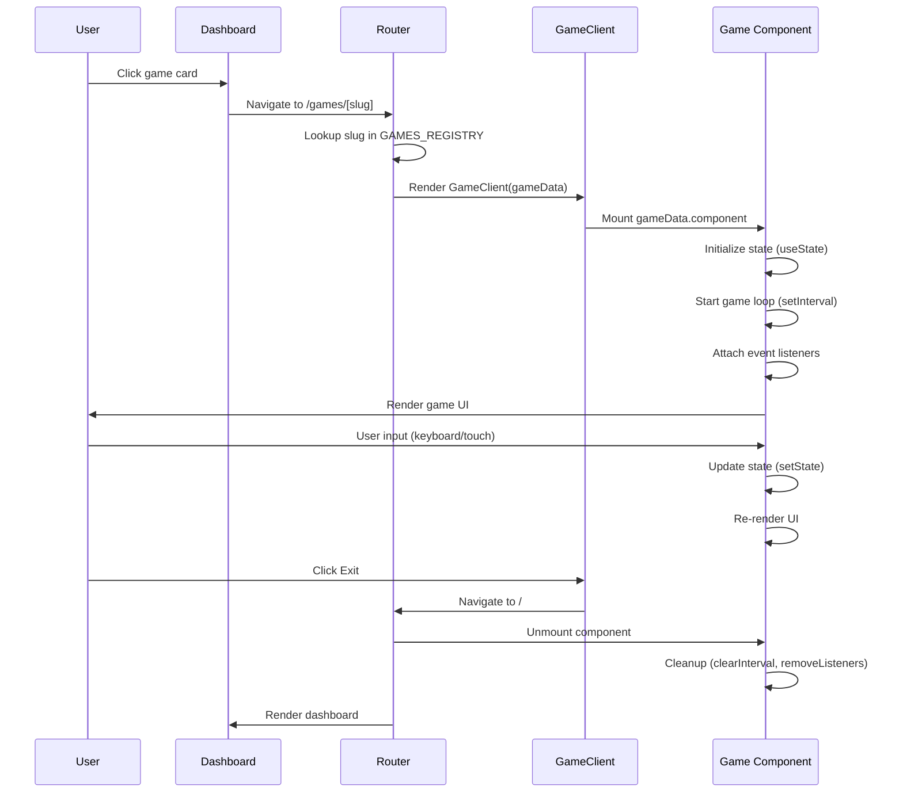

# Mini-Games Platform Architecture — Authoritative Documentation

## Executive Summary

The Mini-Games Platform is a Next.js-based web application that hosts multiple standalone React game components through a registry-driven architecture. The platform uses a fixed timestep game loop model with DOM-based rendering, React state management, and zero-weight asset strategy (emojis and CSS gradients). Games are dynamically routed via URL slugs, mounted within a consistent platform wrapper, and operate as fully client-side components with no persistent state storage. The architecture prioritizes immediate start-up, frame-rate independence, and responsive design through percentage-based positioning.

## Audience & Intent

- **Markdown (this document):** Authoritative architectural truth, state ownership rules, behavioral contracts, integration patterns, and refactor-safe contracts
- **TypeScript/Code:** Compile-time type contracts, runtime behavior implementation, component interfaces
- **JSON Schemas:** Not applicable (no JSON validation schemas in current implementation)
- **CSS/Tailwind:** Visual styling contracts, theme variables, responsive breakpoints

## 1. Architecture Overview

### 1.1 System Hierarchy

```
Next.js App Router
├── app/
│   ├── layout.tsx (Root layout, fonts, analytics)
│   ├── page.tsx (Dashboard - game selection grid)
│   └── games/[slug]/
│       ├── page.tsx (Server component - route handler)
│       └── game-client.tsx (Client wrapper - platform UI)
├── lib/
│   └── games-registry.tsx (Source of truth - game registry)
└── components/games/
    ├── tetris.tsx
    ├── memory-match.tsx
    ├── reflex-tapper.tsx
    └── pick-up-sticks.tsx
```

### 1.2 Component Integration Flow

1. **User Navigation:** User clicks game card on dashboard (`app/page.tsx`)
2. **Route Resolution:** Next.js routes to `/games/[slug]` where `slug` matches registry key
3. **Registry Lookup:** `app/games/[slug]/page.tsx` queries `GAMES_REGISTRY[slug]`
4. **Component Mounting:** `GameClient` receives `gameData` and renders `gameData.component`
5. **Game Execution:** Individual game component manages its own state and lifecycle

### 1.3 Key Integration Points

| Integration Point | Location | Contract |
|------------------|----------|----------|
| Game Registry | `lib/games-registry.tsx` | Exports `GAMES_REGISTRY` object mapping slugs to game metadata |
| Route Handler | `app/games/[slug]/page.tsx` | Accepts `params: Promise<{ slug: string }>`, returns `GameClient` or 404 |
| Game Wrapper | `app/games/[slug]/game-client.tsx` | Accepts `gameData: GameData`, renders platform nav + game viewport |
| Dashboard | `app/page.tsx` | Iterates `Object.values(GAMES_REGISTRY)` to render game cards |
| Theme System | `app/globals.css` | Defines CSS custom properties for dark mode, colors, spacing |

### 1.4 Layout Contracts

**Platform Navigation Bar:**
- Fixed height: `h-16` (64px)
- Background: `bg-zinc-950/50 backdrop-blur-md`
- Contains: Exit link (left), game title (center), placeholder avatar (right)

**Game Viewport:**
- Container: `flex-grow relative w-full overflow-hidden`
- Max width: `max-w-2xl` (672px)
- Centered: `mx-auto`
- Background: `bg-black`

**Dashboard Grid:**
- Responsive: `grid-cols-1 sm:grid-cols-2 lg:grid-cols-3`
- Gap: `gap-6` (24px)
- Card height: `h-64` (256px)

## 2. State Ownership & Source of Truth (Canonical)

| State | Owner | Type | Persistence | Source of Truth |
|-------|-------|------|-------------|-----------------|
| Game Registry | `lib/games-registry.tsx` | System | Build-time (static export) | `GAMES_REGISTRY` constant |
| Active Game Slug | Next.js Router | System | URL parameter | `params.slug` from route |
| Game Component Instance | Individual game component | UI | Component lifecycle | React component state |
| Game State (score, board, etc.) | Individual game component | Domain | None (ephemeral) | `useState` hooks within game component |
| Theme Variables | `app/globals.css` | System | Build-time (CSS) | CSS custom properties (`:root`, `.dark`) |
| Analytics State | Vercel Analytics | System | External service | `@vercel/analytics/next` component |

### 2.1 State Ownership Rules

**Precedence Rules:**
1. **Registry Authority:** `GAMES_REGISTRY` is the single source of truth for game availability. Adding a game requires registry entry.
2. **Route Authority:** URL slug must match registry key exactly. Invalid slugs render 404 page.
3. **Component Isolation:** Each game component owns its internal state. No shared state between games.
4. **No Cross-Game State:** Games do not persist state between sessions or share state with other games.

**State Lifecycle:**
- **Registry:** Loaded at build time, immutable at runtime
- **Route State:** Managed by Next.js router, changes on navigation
- **Game State:** Initialized on component mount, destroyed on unmount, never persisted

## 3. Data Persistence

### 3.1 Storage Strategy

**Current Implementation: NONE**

The platform explicitly does not persist any game state. All state is ephemeral and exists only during the component lifecycle.

| Storage Type | Usage | Status |
|--------------|-------|--------|
| `localStorage` | Not used | ❌ Not implemented |
| `sessionStorage` | Not used | ❌ Not implemented |
| `IndexedDB` | Not used | ❌ Not implemented |
| Server-side storage | Not used | ❌ Not implemented |
| URL query parameters | Not used | ❌ Not implemented |

### 3.2 Failure Modes & Recovery

**No Persistence = No Recovery Needed**

Since no state is persisted, there are no:
- Storage quota errors
- Corrupted state recovery
- Version migration issues
- Cross-tab synchronization conflicts

**Component Unmount Recovery:**
- Games reset to initial state on remount (expected behavior)
- No "resume game" functionality exists

## 4. State Lifecycle

### 4.1 Game Component Lifecycle

```
1. Component Mount
   ├── Initialize state with useState (score: 0, board: empty, etc.)
   ├── Set up game loop (setInterval for discrete ticks)
   ├── Attach event listeners (keydown, touch events)
   └── Begin first game tick

2. Runtime Updates
   ├── Game loop triggers state updates (setState)
   ├── React re-renders UI based on new state
   ├── User input triggers state mutations
   └── Collision/win/loss detection updates game state

3. Component Unmount
   ├── Clear intervals (cleanup in useEffect return)
   ├── Remove event listeners
   ├── Destroy all component state
   └── Next.js unmounts component
```

### 4.2 Platform Lifecycle

```
1. Dashboard Load
   ├── Next.js SSR renders page.tsx
   ├── Client hydrates React components
   ├── Dashboard reads GAMES_REGISTRY
   └── Renders game cards

2. Game Navigation
   ├── User clicks game card → Next.js navigation
   ├── Route handler resolves slug → looks up in registry
   ├── GameClient mounts with gameData prop
   └── Game component mounts and initializes

3. Game Exit
   ├── User clicks "Exit" → Next.js navigation to "/"
   ├── GameClient unmounts
   ├── Game component unmounts (all state destroyed)
   └── Dashboard re-renders
```

## 5. Behaviors (Events & Side Effects)

### 5.1 User Behaviors

| User Action | Trigger | Handler Location | Side Effect |
|-------------|---------|------------------|-------------|
| Click game card | `onClick` on dashboard card | `app/page.tsx` (Link component) | Navigate to `/games/[slug]` |
| Click Exit button | `onClick` on nav link | `app/games/[slug]/game-client.tsx` | Navigate to `/` |
| Keyboard input (WASD/Arrows) | `keydown` event | Individual game component `useEffect` | Game-specific action (move, rotate, etc.) |
| Touch/click game element | `onClick` or `onTouchStart/End` | Individual game component | Game-specific interaction |
| Pause game | `keydown` ("p", "P", "Escape") | Individual game component | Toggle `gameState` to "paused" |

### 5.2 System Behaviors

| System Event | Trigger | Handler Location | Side Effect |
|--------------|---------|------------------|-------------|
| Game loop tick | `setInterval` callback | Individual game component | Update game state (move piece, spawn target, etc.) |
| Timer expiration | `setTimeout` callback | Individual game component | Trigger game over, update countdown |
| Component mount | React lifecycle | Individual game component | Initialize state, start game loop |
| Component unmount | React lifecycle | Individual game component | Clear intervals, remove listeners |
| Route change | Next.js navigation | Next.js router | Unmount previous game, mount new game |

## 6. Event & Callback Contracts

### 6.1 Platform-Level Events

| Event | Trigger | Payload | Side Effects |
|-------|---------|---------|--------------|
| `GAMES_REGISTRY` access | Dashboard render | `Object.values(GAMES_REGISTRY)` | Renders game cards |
| Route resolution | Navigation to `/games/[slug]` | `params: { slug: string }` | Looks up game in registry, renders `GameClient` or 404 |
| Game mount | `GameClient` renders | `gameData: GameData` | Mounts `gameData.component` |

### 6.2 Game Component Event Contracts

**Keyboard Input Contract:**
```typescript
// All games must handle keydown events via useEffect
useEffect(() => {
  const handleKeyDown = (e: KeyboardEvent) => {
    // Game-specific key mapping
    // Must call e.preventDefault() for handled keys
  }
  window.addEventListener("keydown", handleKeyDown)
  return () => window.removeEventListener("keydown", handleKeyDown)
}, [dependencies])
```

**Touch Input Contract (Tetris example):**
```typescript
// Gesture-based games use touchStart/touchEnd
const handleTouchStart = (e: React.TouchEvent) => {
  // Store initial touch coordinates
}
const handleTouchEnd = (e: React.TouchEvent) => {
  // Calculate swipe direction from delta
  // Translate to game action
}
```

**Game Loop Contract:**
```typescript
// Fixed timestep using setInterval
useEffect(() => {
  const interval = setInterval(() => {
    // Update game state (discrete tick)
  }, TICK_INTERVAL_MS)
  return () => clearInterval(interval)
}, [dependencies])
```

## 7. Performance Considerations

### 7.1 Known Limits

| Metric | Current Limit | Tested Threshold | Notes |
|--------|---------------|-----------------|-------|
| Game registry size | 4 games | Not tested | No performance impact expected for < 50 games |
| Game loop frequency | 1000ms (Tetris) | 16ms (60fps equivalent) | Fixed timestep prevents frame-rate dependency |
| Concurrent game instances | 1 | 1 | Only one game mounts at a time |
| DOM elements per game | ~200-400 (Tetris board) | Not tested | CSS Grid/Flexbox handles efficiently |
| Animation elements | ~10-20 (Reflex Tapper targets) | Not tested | Framer Motion GPU acceleration |

### 7.2 Bottlenecks

**Current Bottlenecks:**
- None identified in current implementation

**Potential Bottlenecks (Not Yet Encountered):**
- Large game registry (> 100 games) may slow dashboard render (mitigation: virtual scrolling)
- Complex game state updates may cause React re-render lag (mitigation: React.memo, useMemo)
- Many concurrent animations may strain GPU (mitigation: Framer Motion already optimizes)

### 7.3 Optimization Opportunities

**Deferred Optimizations:**
- **Virtual Scrolling:** Not needed until > 20 games in registry
- **Code Splitting:** Games already lazy-loaded via Next.js dynamic imports (if implemented)
- **State Memoization:** Not needed until performance issues observed
- **Web Workers:** Not applicable (DOM-based rendering requires main thread)

## 8. Accessibility

### 8.1 Current Gaps

| Issue | Severity | Component | Description |
|-------|----------|-----------|-------------|
| Keyboard navigation on dashboard | Minor | `app/page.tsx` | Game cards not keyboard-focusable (Link components may be, but no visible focus indicators) |
| Screen reader labels | Major | All game components | Game elements lack ARIA labels, roles, and descriptions |
| Color contrast | Unknown | All components | Not audited against WCAG AA standards |
| Focus management | Major | `app/games/[slug]/game-client.tsx` | No focus trap or focus return on game exit |
| Touch target size | Minor | Game components | Some targets may be < 44x44px (WCAG minimum) |

### 8.2 Required Tasks (Prioritized)

1. **Critical:** Add ARIA labels to all interactive game elements
2. **Critical:** Implement focus trap within game viewport
3. **High:** Add keyboard navigation support for dashboard (Tab, Enter to select)
4. **High:** Audit color contrast ratios (especially emerald-500 on zinc-950)
5. **Medium:** Add screen reader announcements for game state changes (score, game over)
6. **Medium:** Ensure all touch targets meet 44x44px minimum

## 9. Testing Strategy

### 9.1 Must-Cover Scenarios

**Platform-Level:**
- [ ] Dashboard renders all games from registry
- [ ] Invalid slug returns 404 page
- [ ] Navigation from dashboard to game works
- [ ] Exit button returns to dashboard
- [ ] Game component mounts and unmounts correctly

**Game-Level (per game):**
- [ ] Game initializes with correct initial state
- [ ] Game loop runs at expected interval
- [ ] Keyboard input triggers correct actions
- [ ] Touch input (if applicable) translates to game actions
- [ ] Game over state displays correctly
- [ ] Reset/restart functionality works
- [ ] Component cleanup on unmount (no memory leaks)

**Integration:**
- [ ] Multiple games can be played sequentially without state leakage
- [ ] Platform navigation persists across game switches
- [ ] Theme variables apply correctly to all games

### 9.2 Explicitly Not Tested

- **Cross-browser compatibility:** Not explicitly tested (assumes modern browsers)
- **Performance under load:** No load testing performed
- **Accessibility compliance:** Not audited (see Section 8)
- **Mobile device testing:** Not explicitly tested on physical devices
- **Offline functionality:** Not applicable (no offline requirements)

## 10. Non-Goals / Out of Scope

The following features are explicitly **not** part of the current architecture:

1. **State Persistence:** No save/load functionality, no progress tracking between sessions
2. **User Accounts:** No authentication, no user profiles, no leaderboards (UI placeholder exists but non-functional)
3. **Multiplayer:** No network synchronization, no real-time collaboration
4. **Canvas Rendering:** DOM-based only, no `<canvas>` API usage
5. **Delta Time:** Fixed timestep only, no variable frame-rate support
6. **Asset Loading:** No image/spritesheet loading, emoji-only assets
7. **Game Configuration:** No user-customizable settings (difficulty, controls, etc.)
8. **Analytics Integration:** Vercel Analytics present but no custom game event tracking
9. **PWA Features:** No service worker, no offline support, no install prompt
10. **Internationalization:** English-only, no i18n support

## 11. Common Pitfalls & Sharp Edges

### 11.1 Known Bugs/Quirks

| Issue | Location | Impact | Workaround |
|-------|----------|--------|------------|
| None documented | - | - | - |

### 11.2 Integration Gotchas

**Registry Key Mismatch:**
- **Issue:** URL slug must exactly match registry key (case-sensitive)
- **Example:** `/games/tetris` works, `/games/Tetris` returns 404
- **Prevention:** Use kebab-case consistently in registry keys

**Component Import Path:**
- **Issue:** Registry imports must use `@/components/games/` alias
- **Example:** `import Tetris from "@/components/games/tetris"` (not relative path)
- **Prevention:** Always use TypeScript path aliases defined in `tsconfig.json`

**Event Listener Cleanup:**
- **Issue:** Games must clean up `window` event listeners on unmount
- **Example:** Missing `removeEventListener` causes memory leaks and duplicate handlers
- **Prevention:** Always return cleanup function from `useEffect`

**Game State Isolation:**
- **Issue:** Games must not share state via closures or module-level variables
- **Example:** Shared counter between game instances causes cross-contamination
- **Prevention:** All state must be component-local via `useState`

### 11.3 Configuration Mistakes

**Missing "use client" Directive:**
- **Issue:** Game components using `window` or `document` without `"use client"` cause SSR errors
- **Fix:** Add `"use client"` as first line of all game components

**Incorrect Game Data Type:**
- **Issue:** `GameClient` expects `GameData` type from registry, not raw component
- **Fix:** Always pass `gameData` from registry lookup, not `{ component: MyGame }`

**Theme Variable Override:**
- **Issue:** Games using hardcoded colors instead of theme variables break dark mode
- **Fix:** Use Tailwind classes that respect `dark:` variant or CSS custom properties

### 11.4 Edge Cases

**Rapid Navigation:**
- **Scenario:** User clicks multiple game cards quickly
- **Behavior:** Next.js router handles navigation, previous game unmounts before new one mounts
- **Risk:** Low (React handles cleanup correctly)

**Browser Back Button:**
- **Scenario:** User presses back button during game
- **Behavior:** Game unmounts, dashboard renders
- **Risk:** None (expected behavior)

**Window Resize During Game:**
- **Scenario:** User resizes browser window while game is active
- **Behavior:** Percentage-based positioning adapts, game continues
- **Risk:** None (responsive design handles this)

**Tab Backgrounding:**
- **Scenario:** User switches to another tab
- **Behavior:** `setInterval` continues running (browser behavior)
- **Risk:** Medium (game state may advance while tab is hidden)
- **Mitigation:** Consider `Page Visibility API` to pause games when tab hidden (not implemented)

## 12. Diagrams (Optional)

### 12.1 Component Hierarchy

```mermaid
graph TD
    A[Next.js App Router] --> B[app/layout.tsx]
    A --> C[app/page.tsx Dashboard]
    A --> D[app/games/[slug]/page.tsx]
    
    C --> E[GAMES_REGISTRY]
    D --> E
    D --> F[GameClient]
    F --> G[Game Component]
    
    E --> H[tetris.tsx]
    E --> I[memory-match.tsx]
    E --> J[reflex-tapper.tsx]
    E --> K[pick-up-sticks.tsx]
    
    G --> H
    G --> I
    G --> J
    G --> K
```

**Maintenance Rule:** This diagram is **illustrative**, not authoritative. The component hierarchy and file structure defined in Section 1.1 is the source of truth.

### 12.2 State Flow



**Maintenance Rule:** This diagram is **illustrative**, not authoritative. The state lifecycle defined in Section 4 is the source of truth.

## Conclusion

This document defines the authoritative architecture, state ownership, behavioral contracts, and integration patterns for the Mini-Games Platform. It serves as the single source of truth for:

- **Developers adding new games:** Must follow registry pattern, component structure, and state management rules
- **Developers modifying platform:** Must preserve registry contract, routing behavior, and component lifecycle
- **Developers debugging issues:** Reference state ownership table, event contracts, and common pitfalls
- **Architects planning features:** Reference non-goals to prevent scope creep, performance considerations for scaling

**Maintenance Expectations:**
- Update this document when architectural patterns change
- Add new games to registry following existing pattern
- Document new state ownership when persistence is added (if ever)
- Update accessibility gaps as issues are resolved
- Archive deprecated patterns in appendix if breaking changes occur

**Refactor Safety:**
This document enables safe refactoring by:
- Defining unambiguous state ownership (no conflicts)
- Specifying event contracts (no breaking changes)
- Documenting integration points (no hidden dependencies)
- Listing non-goals (prevents accidental feature creep)

---

**Maintained by:** Development Team  
**Last Updated:** 2025-01-27  
**Version:** 1.0.0
