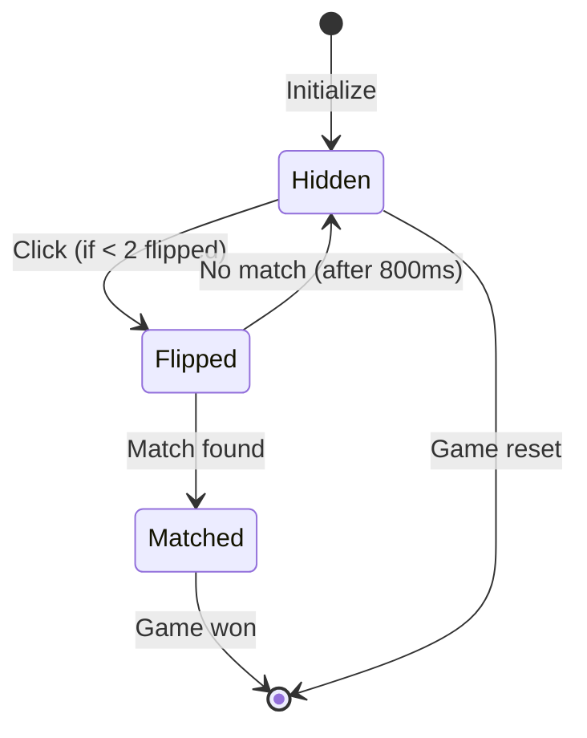

# Memory Match Game Component — Authoritative Documentation

## Executive Summary

Memory Match is a card-matching memory game implemented as a standalone React component. Players flip pairs of cards to find matching emoji pairs within a 4×4 grid (16 cards, 8 pairs). The game tracks moves, enforces a two-card flip limit, and displays a victory modal upon completion. State is managed entirely through React hooks with no persistence. The game uses Framer Motion for card flip animations and click interactions.

## Audience & Intent

- **Markdown (this document):** Authoritative game logic contracts, state ownership, card flip mechanics, win condition rules, and refactor-safe behavior definitions
- **TypeScript/Code:** Runtime implementation, type definitions, component structure
- **CSS/Tailwind:** Visual styling contracts, card appearance states

## 1. Architecture Overview

### 1.1 Component Structure

```typescript
MemoryMatch Component
├── State Management (useState hooks)
│   ├── cards: Array<Card>
│   ├── flippedCards: number[]
│   ├── moves: number
│   └── gameWon: boolean
├── Game Logic Functions
│   ├── initializeGame
│   └── handleCardClick
└── Effects (useEffect)
    └── initializeGame on mount
```

### 1.2 Key Constants

| Constant | Value | Purpose |
|----------|-------|---------|
| `EMOJIS` | 8 emoji strings | Card symbols (🎮, 🎯, 🎲, 🎪, 🎨, 🎭, 🎸, 🎺) |
| Grid size | 4×4 (16 cards) | Fixed grid layout |
| Card pairs | 8 pairs (16 total) | Each emoji appears twice |

### 1.3 Integration Points

| Integration Point | Location | Contract |
|------------------|----------|----------|
| Platform Mount | `app/games/[slug]/game-client.tsx` | Component mounts as `gameData.component` |
| Click Input | `onClick` on card buttons | React synthetic click events |
| Framer Motion | `motion.button`, `AnimatePresence` | Animation library for card flips and win modal |

## 2. State Ownership & Source of Truth (Canonical)

| State | Owner | Type | Persistence | Source of Truth |
|-------|-------|------|-------------|-----------------|
| `cards` | MemoryMatch component | Domain | None | `useState<Array<Card>>` |
| `flippedCards` | MemoryMatch component | Domain | None | `useState<number[]>` |
| `moves` | MemoryMatch component | UI | None | `useState<number>` |
| `gameWon` | MemoryMatch component | Domain | None | `useState<boolean>` |

**Card Interface:**
```typescript
interface Card {
  id: number
  emoji: string
  flipped: boolean
  matched: boolean
}
```

### 2.1 State Ownership Rules

**Precedence Rules:**
1. **Component Isolation:** All state is component-local. No shared state with other games or platform.
2. **Card State Authority:** Each card's `flipped` and `matched` properties control visibility and interactivity.
3. **Flip Limit:** Maximum 2 cards flipped simultaneously (enforced by `flippedCards.length === 2` check).
4. **Array Immutability:** Card updates create new arrays to trigger React re-renders.

**State Lifecycle:**
- **Initialization:** Cards shuffled and initialized on component mount via `useEffect`
- **Runtime Updates:** State mutated via `setState` calls triggered by card clicks
- **Reset:** `initializeGame()` resets all state to initial values
- **Cleanup:** No intervals or listeners to clean up (click-only interaction)

## 3. Data Persistence

### 3.1 Storage Strategy

**Current Implementation: NONE**

No game state is persisted. All progress is lost on component unmount.

| Storage Type | Usage | Status |
|--------------|-------|--------|
| `localStorage` | Not used | ❌ Not implemented |
| `sessionStorage` | Not used | ❌ Not implemented |
| URL parameters | Not used | ❌ Not implemented |

### 3.2 Failure Modes & Recovery

**No Persistence = No Recovery Needed**

- Game resets to initial shuffled state on remount (expected behavior)
- No "resume game" functionality exists

## 4. State Lifecycle

### 4.1 Game Lifecycle Sequence

```
1. Component Mount
   ├── useEffect triggers initializeGame()
   ├── EMOJIS array doubled (8 → 16 cards)
   ├── Cards shuffled using Math.random()
   ├── Cards initialized with id, emoji, flipped: false, matched: false
   ├── flippedCards set to []
   ├── moves set to 0
   └── gameWon set to false

2. Card Click
   ├── handleCardClick(id) called
   ├── Validation: flippedCards.length === 2? Return early
   ├── Validation: card.flipped or card.matched? Return early
   ├── Card flipped: card.flipped = true
   ├── Card ID added to flippedCards array
   └── If flippedCards.length === 2: Start match check

3. Match Check (2 cards flipped)
   ├── moves incremented
   ├── setTimeout(800ms) delays match evaluation
   ├── Compare cards[first].emoji === cards[second].emoji
   ├── If match:
   │   ├── Both cards.matched = true
   │   ├── Check if all cards matched
   │   └── If all matched: gameWon = true
   └── If no match:
       ├── Both cards.flipped = false
       └── flippedCards reset to []

4. Victory
   ├── gameWon = true triggers win modal
   ├── Modal displays final moves count
   └── "Play Again" button calls initializeGame()

5. Component Unmount
   └── All state destroyed
```

## 5. Behaviors (Events & Side Effects)

### 5.1 User Behaviors

| User Action | Trigger | Handler | Side Effect |
|-------------|---------|---------|-------------|
| Click card | `onClick` | `handleCardClick(id)` | Card flips if valid, match check if 2 cards flipped |
| Click "Play Again" | `onClick` | `initializeGame()` | All state reset, new shuffle |

### 5.2 System Behaviors

| System Event | Trigger | Handler | Side Effect |
|--------------|---------|---------|-------------|
| Component mount | React lifecycle | `useEffect(() => initializeGame(), [])` | Game initialized with shuffled cards |
| Match timeout | `setTimeout(800ms)` | Match evaluation logic | Cards compared, flipped back or marked matched |
| All cards matched | `cards.every(card => card.matched)` | Win condition check | `gameWon` set to `true`, modal displays |

## 6. Event & Callback Contracts

### 6.1 Card Click Contract

```typescript
const handleCardClick = (id: number) => {
  // Validation: Maximum 2 cards flipped
  if (flippedCards.length === 2) return
  
  // Validation: Card already flipped or matched
  if (cards[id].flipped || cards[id].matched) return
  
  // Flip card
  const newCards = [...cards]
  newCards[id].flipped = true
  setCards(newCards)
  
  // Add to flipped array
  const newFlipped = [...flippedCards, id]
  setFlippedCards(newFlipped)
  
  // If 2 cards flipped, check match after delay
  if (newFlipped.length === 2) {
    setMoves(moves + 1)
    
    setTimeout(() => {
      const [first, second] = newFlipped
      if (cards[first].emoji === cards[second].emoji) {
        // Match: mark both as matched
        newCards[first].matched = true
        newCards[second].matched = true
        
        // Check win condition
        if (newCards.every((card) => card.matched)) {
          setGameWon(true)
        }
      } else {
        // No match: flip both back
        newCards[first].flipped = false
        newCards[second].flipped = false
      }
      setCards([...newCards])
      setFlippedCards([])
    }, 800)
  }
}
```

**Contract Rules:**
- Must validate `flippedCards.length === 2` before allowing new flip
- Must validate card is not already flipped or matched
- Must create new array copies for state updates (immutability)
- Match check delayed 800ms to allow user to see both cards
- `setTimeout` not cleaned up (acceptable for single-use timeout)

### 6.2 Initialization Contract

```typescript
const initializeGame = () => {
  const doubled = [...EMOJIS, ...EMOJIS]  // 8 → 16 cards
  const shuffled = doubled
    .sort(() => Math.random() - 0.5)  // Fisher-Yates shuffle
    .map((emoji, idx) => ({
      id: idx,
      emoji,
      flipped: false,
      matched: false,
    }))
  setCards(shuffled)
  setFlippedCards([])
  setMoves(0)
  setGameWon(false)
}
```

**Contract Rules:**
- Must double EMOJIS array to create pairs
- Must shuffle using `Math.random()` (no seed, different each game)
- Must assign sequential IDs (0-15)
- Must reset all state to initial values

## 7. Game Logic Contracts

### 7.1 Card Flip Rules

**Rules:**
- Maximum 2 cards flipped simultaneously
- Flipped cards show emoji, unflipped show "?"
- Matched cards remain visible (flipped state persists)
- Clicking flipped or matched card does nothing

### 7.2 Match Detection

**Rules:**
- Match determined by `card.emoji === card.emoji` comparison
- Match check occurs 800ms after second card flip
- Matched cards: `matched = true`, remain flipped
- Unmatched cards: `flipped = false`, return to "?" state

### 7.3 Win Condition

**Rules:**
- Win triggered when `cards.every(card => card.matched)`
- Win modal displays final moves count
- "Play Again" button resets game

### 7.4 Move Counting

**Rules:**
- Move incremented when 2 cards are flipped (regardless of match)
- Move count displayed in stats bar
- Move count reset on game restart

## 8. Performance Considerations

### 8.1 Known Limits

| Metric | Current Limit | Tested Threshold | Notes |
|--------|---------------|-----------------|-------|
| Card count | 16 cards | Not tested | DOM handles efficiently |
| Re-render frequency | On each card click | Not tested | React optimizations handle efficiently |
| Animation count | 2 cards max animated | Not tested | Framer Motion GPU acceleration |

### 8.2 Bottlenecks

**Current Bottlenecks:**
- None identified in current implementation

**Potential Bottlenecks:**
- Large card arrays (not applicable, fixed at 16)
- Frequent re-renders on card flips (mitigation: React virtual DOM handles efficiently)

### 8.3 Optimization Opportunities

**Deferred Optimizations:**
- **Memoization:** Card components not memoized (not needed for 16 cards)
- **Virtual Scrolling:** Not applicable (fixed grid size)

## 9. Accessibility

### 9.1 Current Gaps

| Issue | Severity | Description |
|-------|----------|-------------|
| Keyboard navigation | Major | Cards not keyboard-focusable, no Tab navigation |
| Screen reader support | Major | No ARIA labels, roles, or announcements for card flips |
| Color contrast | Unknown | Card colors not audited against WCAG AA |
| Game state announcements | Major | No announcements for matches, win condition |
| Touch target size | Minor | Cards are grid-based, size depends on viewport |

### 9.2 Required Tasks (Prioritized)

1. **Critical:** Add keyboard navigation (Tab to focus cards, Enter/Space to flip)
2. **Critical:** Add ARIA labels to cards (`aria-label` with emoji name)
3. **High:** Add `role="button"` to card elements
4. **High:** Add live region for match announcements
5. **Medium:** Audit color contrast for card backgrounds
6. **Medium:** Add focus indicators for keyboard navigation

## 10. Testing Strategy

### 10.1 Must-Cover Scenarios

**Game Logic:**
- [ ] Game initializes with 16 cards (8 pairs)
- [ ] Cards are shuffled differently each game
- [ ] Maximum 2 cards can be flipped at once
- [ ] Clicking flipped card does nothing
- [ ] Clicking matched card does nothing
- [ ] Matching cards remain visible
- [ ] Non-matching cards flip back after 800ms
- [ ] Moves increment on each pair flip
- [ ] Win condition triggers when all cards matched
- [ ] "Play Again" resets all state

**State Management:**
- [ ] Component initializes with correct default state
- [ ] State updates trigger re-renders
- [ ] No memory leaks (setTimeout cleaned up implicitly)

### 10.2 Explicitly Not Tested

- **Cross-browser compatibility:** Not explicitly tested
- **Performance under stress:** No load testing
- **Accessibility compliance:** Not audited (see Section 9)
- **Mobile device testing:** Not tested on physical devices

## 11. Non-Goals / Out of Scope

The following features are explicitly **not** part of the current implementation:

1. **Timer:** No time limit or elapsed time tracking
2. **Difficulty Levels:** No variable grid sizes or card counts
3. **High Score:** No best moves tracking or persistence
4. **Card Themes:** No alternative emoji sets or themes
5. **Hints System:** No reveal mechanism or hints
6. **Sound Effects:** No audio feedback for matches/flips
7. **Multiplayer:** No turn-based or competitive modes
8. **Statistics:** No game history or analytics
9. **Customization:** No card back designs or color schemes
10. **Replay:** No undo or move history

## 12. Common Pitfalls & Sharp Edges

### 12.1 Known Bugs/Quirks

| Issue | Location | Impact | Workaround |
|-------|----------|--------|------------|
| None documented | - | - | - |

### 12.2 Integration Gotchas

**State Update Timing:**
- **Issue:** `setTimeout` callback uses stale `cards` state from closure
- **Example:** If cards state updates during timeout, match check uses old state
- **Prevention:** Current implementation works correctly, but be careful with closures in timeouts

**Shuffle Randomness:**
- **Issue:** `Math.random() - 0.5` shuffle is not cryptographically secure
- **Example:** Shuffle pattern may be predictable (not an issue for games)
- **Prevention:** Acceptable for game use, but not for security-sensitive applications

**Multiple Rapid Clicks:**
- **Issue:** User can click multiple cards rapidly before validation
- **Example:** Clicking 3 cards quickly may bypass 2-card limit
- **Prevention:** Current validation prevents this, but race conditions possible with very rapid clicks

### 12.3 Configuration Mistakes

**Missing Validation:**
- **Issue:** Not checking `flippedCards.length === 2` before allowing flip
- **Fix:** Always validate flip limit before state update

**State Immutability:**
- **Issue:** Mutating cards array directly instead of creating copy
- **Fix:** Always use `[...cards]` or `cards.map()` for updates

**Timeout Not Handled:**
- **Issue:** `setTimeout` not cleaned up if component unmounts during delay
- **Fix:** Store timeout ID and clear on unmount (not critical for 800ms delay, but best practice)

### 12.4 Edge Cases

**Component Unmount During Timeout:**
- **Scenario:** User navigates away during 800ms match delay
- **Behavior:** `setTimeout` callback may execute after unmount, causing state update warning
- **Risk:** Low (React handles gracefully, but warning in console)
- **Mitigation:** Store timeout ID and clear in cleanup function

**All Cards Matched on Last Move:**
- **Scenario:** Final pair matches, win condition triggers
- **Behavior:** Win modal displays immediately after match timeout
- **Risk:** None (expected behavior)

**Rapid Card Clicks:**
- **Scenario:** User clicks cards very quickly
- **Behavior:** Validation prevents more than 2 flips, but rapid clicks may feel unresponsive
- **Risk:** Low (acceptable UX trade-off)

## 13. Diagrams (Optional)

### 13.1 Card State Machine



**Maintenance Rule:** This diagram is **illustrative**, not authoritative. The card state logic defined in Section 4 is the source of truth.

## Conclusion

This document defines the authoritative architecture, state ownership, game logic contracts, and behavioral rules for the Memory Match game component. It serves as the single source of truth for:

- **Developers modifying game logic:** Must follow card flip rules, match detection, and state management patterns
- **Developers adding features:** Must preserve existing contracts, click handling, and win condition
- **Developers debugging issues:** Reference state ownership table, event contracts, and common pitfalls
- **Architects planning enhancements:** Reference non-goals to prevent scope creep

**Maintenance Expectations:**
- Update this document when game mechanics change
- Document new state variables when added
- Update win condition if changed
- Archive deprecated patterns if breaking changes occur

**Refactor Safety:**
This document enables safe refactoring by:
- Defining unambiguous state ownership (no conflicts)
- Specifying game logic contracts (flip rules, match detection)
- Documenting click handling rules
- Listing non-goals (prevents accidental feature additions)

---

**Maintained by:** Development Team  
**Last Updated:** 2025-01-27  
**Version:** 1.0.0
