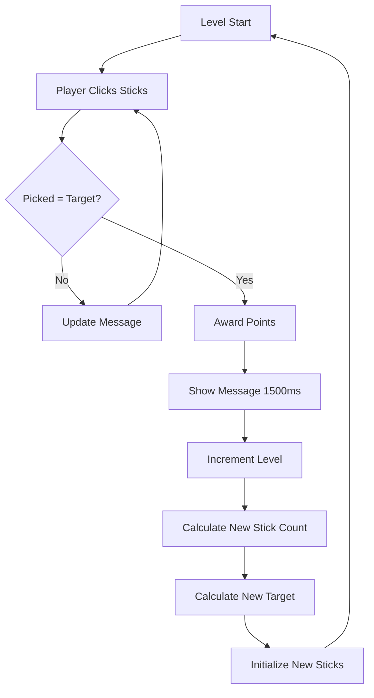

# Pick Up Sticks Game Component — Authoritative Documentation

## Executive Summary

Pick Up Sticks is a level-based collection game implemented as a standalone React component. Players must tap a target number of sticks from a grid to complete each level. The game features progressive difficulty with increasing stick counts and target requirements per level. Each level completion awards points based on the current level, and the game continues indefinitely until the player stops. State is managed entirely through React hooks with no persistence. The game uses Framer Motion for stick removal animations and level transition feedback.

## Audience & Intent

- **Markdown (this document):** Authoritative game logic contracts, state ownership, level progression mechanics, scoring rules, and refactor-safe behavior definitions
- **TypeScript/Code:** Runtime implementation, type definitions, component structure
- **CSS/Tailwind:** Visual styling contracts, stick appearance, gradient colors

## 1. Architecture Overview

### 1.1 Component Structure

```typescript
PickUpSticks Component
├── State Management (useState hooks)
│   ├── sticks: Array<Stick>
│   ├── targetCount: number
│   ├── picked: number
│   ├── score: number
│   ├── level: number
│   ├── gameOver: boolean
│   └── message: string
├── Game Logic Functions
│   ├── initializeSticks
│   ├── handleStickClick
│   └── resetGame
└── Effects (useEffect)
    └── initializeSticks on mount
```

### 1.2 Key Constants

| Constant | Value | Purpose |
|----------|-------|---------|
| Initial stick count | 12 | Starting number of sticks |
| Initial target | 5 | Starting target count |
| Initial level | 1 | Starting level |
| Points per level | level × 50 | Score awarded per level completion |
| Stick colors | 6 gradient colors | Color rotation for visual variety |
| Level progression | +2 sticks, +1 target per level | Difficulty scaling |

### 1.3 Integration Points

| Integration Point | Location | Contract |
|------------------|----------|----------|
| Platform Mount | `app/games/[slug]/game-client.tsx` | Component mounts as `gameData.component` |
| Click Input | `onClick` on stick buttons | React synthetic click events |
| Framer Motion | `motion.button`, `AnimatePresence` | Animation library for stick removal and messages |

## 2. State Ownership & Source of Truth (Canonical)

| State | Owner | Type | Persistence | Source of Truth |
|-------|-------|------|-------------|-----------------|
| `sticks` | PickUpSticks component | Domain | None | `useState<Stick[]>` |
| `targetCount` | PickUpSticks component | Domain | None | `useState<number>` |
| `picked` | PickUpSticks component | Domain | None | `useState<number>` |
| `score` | PickUpSticks component | UI | None | `useState<number>` |
| `level` | PickUpSticks component | Domain | None | `useState<number>` |
| `gameOver` | PickUpSticks component | Domain | None | `useState<boolean>` |
| `message` | PickUpSticks component | UI | None | `useState<string>` |

**Stick Interface:**
```typescript
interface Stick {
  id: number
  color: string  // Tailwind gradient class
}
```

### 2.1 State Ownership Rules

**Precedence Rules:**
1. **Component Isolation:** All state is component-local. No shared state with other games or platform.
2. **Game Over Authority:** `gameOver` flag exists but is never set to `true` in current implementation (infinite progression).
3. **Array Immutability:** Stick updates create new arrays to trigger React re-renders.
4. **Level Progression:** Level increases automatically when target reached, no manual advancement.

**State Lifecycle:**
- **Initialization:** Sticks and state initialized on component mount via `useEffect`
- **Runtime Updates:** State mutated via `setState` calls triggered by stick clicks
- **Reset:** `resetGame()` resets all state to initial values
- **Cleanup:** No intervals or listeners to clean up (click-only interaction)

## 3. Data Persistence

### 3.1 Storage Strategy

**Current Implementation: NONE**

No game state is persisted. All progress is lost on component unmount.

| Storage Type | Usage | Status |
|--------------|-------|--------|
| `localStorage` | Not used | ❌ Not implemented |
| `sessionStorage` | Not used | ❌ Not implemented |
| URL parameters | Not used | ❌ Not implemented |

### 3.2 Failure Modes & Recovery

**No Persistence = No Recovery Needed**

- Game resets to initial state on remount (expected behavior)
- No "resume game" functionality exists

## 4. State Lifecycle

### 4.1 Game Lifecycle Sequence

```
1. Component Mount
   ├── useEffect triggers initializeSticks(12)
   ├── Sticks initialized with id (0-11) and color rotation
   ├── targetCount initialized to 5
   ├── picked initialized to 0
   ├── score initialized to 0
   ├── level initialized to 1
   ├── gameOver initialized to false
   └── message initialized to ""

2. Stick Click
   ├── handleStickClick(id) called
   ├── Validation: gameOver? Return early
   ├── picked incremented
   ├── Stick removed from sticks array
   ├── If picked === targetCount:
   │   ├── Points calculated: level × 50
   │   ├── score incremented
   │   ├── message set to "+{points} points!"
   │   ├── setTimeout(1500ms) delays level progression
   │   └── After delay:
   │       ├── level incremented
   │       ├── New stick count: 12 + level × 2
   │       ├── New target: min(5 + level, stickCount - 2)
   │       ├── Sticks reinitialized
   │       ├── targetCount updated
   │       ├── picked reset to 0
   │       └── message cleared
   └── Else if picked < targetCount:
       └── message set to "{remaining} more to go!"

3. Level Progression
   ├── Level completion detected (picked === targetCount)
   ├── Score awarded (level × 50)
   ├── Message displayed for 1500ms
   ├── Level increments: level + 1
   ├── Stick count increases: 12 + level × 2
   ├── Target increases: min(5 + level, stickCount - 2)
   └── New level begins

4. Component Unmount
   └── All state destroyed
```

## 5. Behaviors (Events & Side Effects)

### 5.1 User Behaviors

| User Action | Trigger | Handler | Side Effect |
|-------------|---------|---------|-------------|
| Click stick | `onClick` | `handleStickClick(id)` | Stick removed, picked incremented, message updated |
| Click reset (if exists) | `onClick` | `resetGame()` | All state reset to initial values |

### 5.2 System Behaviors

| System Event | Trigger | Handler | Side Effect |
|--------------|---------|---------|-------------|
| Component mount | React lifecycle | `useEffect(() => initializeSticks(12), [])` | Game initialized with 12 sticks |
| Level completion | `picked === targetCount` | Level progression logic | Level increases, new sticks generated |
| Message timeout | `setTimeout(1500ms)` | Message clearing | Message cleared after level transition |

## 6. Event & Callback Contracts

### 6.1 Stick Click Contract

```typescript
const handleStickClick = (id: number) => {
  if (gameOver) return
  
  const newPicked = picked + 1
  setPicked(newPicked)
  setSticks(sticks.filter((s) => s.id !== id))
  
  if (newPicked === targetCount) {
    // Level complete
    const pointsEarned = level * 50
    setScore(score + pointsEarned)
    setMessage(`+${pointsEarned} points!`)
    
    setTimeout(() => {
      const nextLevel = level + 1
      setLevel(nextLevel)
      const nextStickCount = 12 + nextLevel * 2
      const nextTarget = Math.min(5 + nextLevel, nextStickCount - 2)
      setSticks(initializeSticks(nextStickCount))
      setTargetCount(nextTarget)
      setPicked(0)
      setMessage("")
    }, 1500)
  } else if (newPicked < targetCount) {
    setMessage(`${targetCount - newPicked} more to go!`)
  }
}
```

**Contract Rules:**
- Must validate `gameOver` before processing click
- Removes stick from array by ID
- Increments `picked` counter
- Level completion triggers after 1500ms delay
- Message updates provide feedback on progress

### 6.2 Initialization Contract

```typescript
const initializeSticks = (count: number) => {
  const colors = [
    "from-red-500 to-red-700",
    "from-blue-500 to-blue-700",
    "from-green-500 to-green-700",
    "from-yellow-500 to-yellow-700",
    "from-purple-500 to-purple-700",
    "from-pink-500 to-pink-700",
  ]
  return Array.from({ length: count }, (_, i) => ({
    id: i,
    color: colors[i % colors.length],  // Color rotation
  }))
}
```

**Contract Rules:**
- Must create array of specified length
- IDs are sequential (0 to count-1)
- Colors rotate through 6 gradient options
- Returns new array (no mutation)

### 6.3 Reset Contract

```typescript
const resetGame = () => {
  setSticks(initializeSticks(12))
  setTargetCount(5)
  setPicked(0)
  setScore(0)
  setLevel(1)
  setGameOver(false)
  setMessage("")
}
```

**Contract Rules:**
- Must reset all state to initial values
- Sticks reinitialized with count 12
- All counters reset to starting values

## 7. Game Logic Contracts

### 7.1 Stick Removal Rules

**Rules:**
- Clicking stick removes it from array immediately
- `picked` counter increments
- Stick cannot be clicked again (removed from DOM)
- No validation needed (stick exists if clickable)

### 7.2 Level Progression

**Rules:**
- Level completes when `picked === targetCount`
- Points awarded: `level × 50`
- Level increments: `level + 1`
- Stick count increases: `12 + level × 2`
- Target increases: `min(5 + level, stickCount - 2)`
- Progression delayed 1500ms for message display

### 7.3 Scoring System

| Action | Points | Formula |
|--------|--------|---------|
| Level completion | level × 50 | `level * 50` |

**Rules:**
- Points awarded only on level completion
- No points for individual stick clicks
- Score accumulates across levels
- Score reset on game restart

### 7.4 Target Calculation

**Rules:**
- Initial target: 5
- Target increases: `5 + level`
- Maximum target: `stickCount - 2` (ensures at least 2 sticks remain)
- Formula: `Math.min(5 + level, stickCount - 2)`

### 7.5 Message System

**Rules:**
- Progress message: `"{remaining} more to go!"` when `picked < targetCount`
- Completion message: `"+{points} points!"` when level completes
- Message cleared after 1500ms delay
- Message displayed in animated banner

## 8. Performance Considerations

### 8.1 Known Limits

| Metric | Current Limit | Tested Threshold | Notes |
|--------|---------------|-----------------|-------|
| Stick count | 12 + level × 2 (unbounded) | Not tested | Maximum theoretical: unlimited (level increases indefinitely) |
| Re-render frequency | On each stick click | Not tested | React optimizations handle efficiently |
| Animation count | Up to stick count | Not tested | Framer Motion GPU acceleration |

### 8.2 Bottlenecks

**Current Bottlenecks:**
- None identified in current implementation

**Potential Bottlenecks:**
- Very high levels may have many sticks (mitigation: Grid layout handles efficiently)
- Level progression delay (1500ms) may feel slow (acceptable UX trade-off)

### 8.3 Optimization Opportunities

**Deferred Optimizations:**
- **Memoization:** Stick components not memoized (not needed for small counts)
- **Virtual Scrolling:** Not applicable (grid layout)

## 9. Accessibility

### 9.1 Current Gaps

| Issue | Severity | Description |
|-------|----------|-------------|
| Keyboard navigation | Major | Sticks not keyboard-focusable, no Tab navigation |
| Screen reader support | Major | No ARIA labels, roles, or announcements for stick removal |
| Color contrast | Unknown | Stick gradient colors not audited against WCAG AA |
| Game state announcements | Major | No announcements for level completion, score, progress |
| Touch target size | Minor | Sticks are grid-based, size depends on viewport |

### 9.2 Required Tasks (Prioritized)

1. **Critical:** Add keyboard navigation (Tab to focus sticks, Enter/Space to click)
2. **Critical:** Add ARIA labels to sticks (`aria-label="Stick {number}"`)
3. **High:** Add live region for level completion and progress announcements
4. **High:** Add `role="button"` to stick elements
5. **Medium:** Audit color contrast for stick gradients
6. **Medium:** Ensure touch targets meet 44×44px minimum

## 10. Testing Strategy

### 10.1 Must-Cover Scenarios

**Game Logic:**
- [ ] Game initializes with 12 sticks and target 5
- [ ] Clicking stick removes it and increments picked
- [ ] Progress message updates correctly
- [ ] Level completes when picked equals target
- [ ] Points awarded correctly (level × 50)
- [ ] Level increments on completion
- [ ] Stick count increases correctly (12 + level × 2)
- [ ] Target increases correctly (min(5 + level, stickCount - 2))
- [ ] Message displays for 1500ms then clears
- [ ] Reset function restores initial state

**State Management:**
- [ ] Component initializes with correct default state
- [ ] State updates trigger re-renders
- [ ] No memory leaks (setTimeout cleaned up implicitly)

### 10.2 Explicitly Not Tested

- **Cross-browser compatibility:** Not explicitly tested
- **Performance under stress:** No load testing with high levels
- **Accessibility compliance:** Not audited (see Section 9)
- **Mobile device testing:** Not tested on physical devices

## 11. Non-Goals / Out of Scope

The following features are explicitly **not** part of the current implementation:

1. **Game Over Condition:** No end condition (infinite progression)
2. **Timer:** No time limit or elapsed time tracking
3. **High Score:** No best score tracking or persistence
4. **Difficulty Selection:** No starting level or difficulty options
5. **Stick Types:** No special sticks or power-ups
6. **Combo System:** No bonus for rapid clicks
7. **Sound Effects:** No audio feedback for clicks or level completion
8. **Multiplayer:** No competitive or cooperative modes
9. **Statistics:** No game history or analytics
10. **Customization:** No stick appearance options

## 12. Common Pitfalls & Sharp Edges

### 12.1 Known Bugs/Quirks

| Issue | Location | Impact | Workaround |
|-------|----------|--------|------------|
| `gameOver` never set | State exists but unused | None | Flag exists for potential future use |

### 12.2 Integration Gotchas

**State Update Timing:**
- **Issue:** `setTimeout` callback uses stale state from closure
- **Example:** If state updates during timeout, level progression may use old values
- **Prevention:** Current implementation works correctly, but be careful with closures

**Target Calculation Edge Case:**
- **Issue:** `Math.min(5 + level, stickCount - 2)` may limit target growth
- **Example:** At high levels, target may not increase as expected
- **Prevention:** Formula ensures at least 2 sticks remain, but may feel limiting

**Level Progression Delay:**
- **Issue:** 1500ms delay may feel slow for rapid players
- **Example:** User completes level quickly, must wait for message
- **Prevention:** Acceptable UX trade-off, but consider reducing delay

### 12.3 Configuration Mistakes

**Missing Validation:**
- **Issue:** Not checking `gameOver` before processing click (current implementation checks but flag never set)
- **Fix:** Validation exists but could be removed if gameOver never used

**State Immutability:**
- **Issue:** Mutating sticks array directly instead of creating copy
- **Fix:** Always use `sticks.filter()` for updates

**Timeout Not Handled:**
- **Issue:** `setTimeout` not cleaned up if component unmounts during delay
- **Fix:** Store timeout ID and clear on unmount (not critical for 1500ms delay, but best practice)

### 12.4 Edge Cases

**Component Unmount During Timeout:**
- **Scenario:** User navigates away during level progression delay
- **Behavior:** `setTimeout` callback may execute after unmount, causing state update warning
- **Risk:** Low (React handles gracefully, but warning in console)
- **Mitigation:** Store timeout ID and clear in cleanup function

**Very High Levels:**
- **Scenario:** Player reaches very high level (100+)
- **Behavior:** Stick count and target increase indefinitely
- **Risk:** Low (game continues, but may become unwieldy)
- **Mitigation:** Consider adding maximum level or game over condition

**Rapid Stick Clicks:**
- **Scenario:** User clicks sticks very quickly
- **Behavior:** Sticks removed immediately, picked increments correctly
- **Risk:** None (expected behavior)

## 13. Diagrams (Optional)

### 13.1 Level Progression Flow



**Maintenance Rule:** This diagram is **illustrative**, not authoritative. The level progression logic defined in Section 4 is the source of truth.

## Conclusion

This document defines the authoritative architecture, state ownership, game logic contracts, and behavioral rules for the Pick Up Sticks game component. It serves as the single source of truth for:

- **Developers modifying game logic:** Must follow level progression rules, scoring formulas, and state management patterns
- **Developers adding features:** Must preserve existing contracts, click handling, and progression behavior
- **Developers debugging issues:** Reference state ownership table, event contracts, and common pitfalls
- **Architects planning enhancements:** Reference non-goals to prevent scope creep

**Maintenance Expectations:**
- Update this document when game mechanics change
- Document new state variables when added
- Update level progression formulas if changed
- Archive deprecated patterns if breaking changes occur

**Refactor Safety:**
This document enables safe refactoring by:
- Defining unambiguous state ownership (no conflicts)
- Specifying game logic contracts (level progression, scoring)
- Documenting click handling rules
- Listing non-goals (prevents accidental feature additions)

---

**Maintained by:** Development Team  
**Last Updated:** 2025-01-27  
**Version:** 1.0.0
