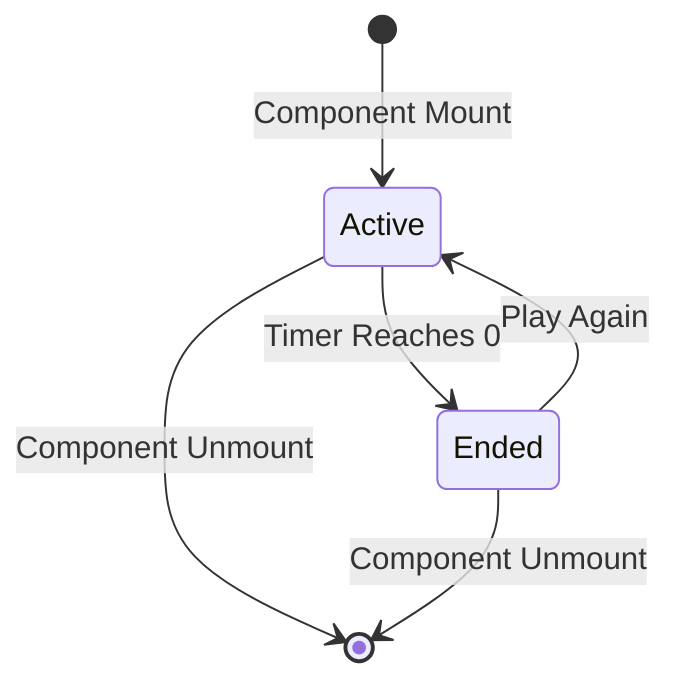

# Reflex Tapper Game Component — Authoritative Documentation

## Executive Summary

Reflex Tapper is a time-based action game implemented as a standalone React component. Players must click/tap targets that spawn randomly on screen within a 20-second time limit. Each target awards 10 points and disappears after 1.5 seconds if not clicked. The game uses percentage-based positioning for responsive target placement, Framer Motion for spawn/despawn animations, and a countdown timer that ends the game when it reaches zero. State is managed entirely through React hooks with no persistence.

## Audience & Intent

- **Markdown (this document):** Authoritative game logic contracts, state ownership, spawn mechanics, scoring rules, and refactor-safe behavior definitions
- **TypeScript/Code:** Runtime implementation, type definitions, component structure
- **CSS/Tailwind:** Visual styling contracts, target positioning, responsive layout

## 1. Architecture Overview

### 1.1 Component Structure

```typescript
ReflexTapper Component
├── State Management (useState hooks)
│   ├── targets: Array<Target>
│   ├── score: number
│   ├── timeLeft: number
│   └── gameActive: boolean
├── Game Logic Functions
│   ├── handleTargetClick
│   └── resetGame
└── Effects (useEffect)
    ├── Target spawn interval
    └── Countdown timer
```

### 1.2 Key Constants

| Constant | Value | Purpose |
|----------|-------|---------|
| Initial time | 20 seconds | Game duration |
| Spawn interval | 800ms | Time between target spawns |
| Target lifetime | 1500ms | Time before target auto-despawns |
| Points per target | 10 | Score awarded per click |
| Spawn area | x: 10-90%, y: 15-85% | Percentage-based positioning bounds |

### 1.3 Integration Points

| Integration Point | Location | Contract |
|------------------|----------|----------|
| Platform Mount | `app/games/[slug]/game-client.tsx` | Component mounts as `gameData.component` |
| Click Input | `onClick` on target buttons | React synthetic click events |
| Framer Motion | `motion.button`, `AnimatePresence` | Animation library for spawn/despawn animations |

## 2. State Ownership & Source of Truth (Canonical)

| State | Owner | Type | Persistence | Source of Truth |
|-------|-------|------|-------------|-----------------|
| `targets` | ReflexTapper component | Domain | None | `useState<Array<Target>>` |
| `score` | ReflexTapper component | UI | None | `useState<number>` |
| `timeLeft` | ReflexTapper component | Domain | None | `useState<number>` |
| `gameActive` | ReflexTapper component | Domain | None | `useState<boolean>` |

**Target Interface:**
```typescript
interface Target {
  id: number
  x: number  // Percentage (10-90)
  y: number  // Percentage (15-85)
}
```

### 2.1 State Ownership Rules

**Precedence Rules:**
1. **Component Isolation:** All state is component-local. No shared state with other games or platform.
2. **Game Active Authority:** `gameActive` controls spawn and timer execution. Both effects check `gameActive` before running.
3. **Target Array Immutability:** Target updates create new arrays to trigger React re-renders.
4. **Timer Authority:** `timeLeft` controls game end. When `timeLeft === 0`, `gameActive` set to `false`.

**State Lifecycle:**
- **Initialization:** All state initialized on component mount via `useState` default values
- **Runtime Updates:** State mutated via `setState` calls triggered by spawn interval, timer, or user clicks
- **Reset:** `resetGame()` resets all state to initial values
- **Cleanup:** All intervals and timeouts cleaned up on component unmount

## 3. Data Persistence

### 3.1 Storage Strategy

**Current Implementation: NONE**

No game state is persisted. All progress is lost on component unmount.

| Storage Type | Usage | Status |
|--------------|-------|--------|
| `localStorage` | Not used | ❌ Not implemented |
| `sessionStorage` | Not used | ❌ Not implemented |
| URL parameters | Not used | ❌ Not implemented |

### 3.2 Failure Modes & Recovery

**No Persistence = No Recovery Needed**

- Game resets to initial state on remount (expected behavior)
- No "resume game" functionality exists

## 4. State Lifecycle

### 4.1 Game Lifecycle Sequence

```
1. Component Mount
   ├── targets initialized to []
   ├── score initialized to 0
   ├── timeLeft initialized to 20
   ├── gameActive initialized to true
   └── Effects start (spawn interval, countdown timer)

2. Target Spawn Loop
   ├── setInterval(800ms) spawns new target
   ├── Target ID: Date.now() (timestamp)
   ├── Target position: random x (10-90%), y (15-85%)
   ├── Target added to targets array
   └── setTimeout(1500ms) removes target if not clicked

3. Countdown Timer
   ├── setInterval(1000ms) decrements timeLeft
   ├── timeLeft decreases: 20 → 19 → ... → 1 → 0
   └── When timeLeft === 0: gameActive set to false

4. Target Click
   ├── handleTargetClick(id) called
   ├── Target removed from targets array
   └── score incremented by 10

5. Game End
   ├── timeLeft reaches 0
   ├── gameActive set to false
   ├── Spawn interval stops (gameActive check)
   ├── Timer stops (gameActive check)
   └── Game over modal displays

6. Reset
   ├── "Play Again" button calls resetGame()
   ├── All state reset to initial values
   └── Effects restart (new game begins)

7. Component Unmount
   ├── Spawn interval cleared
   ├── Timer timeout cleared
   └── All state destroyed
```

## 5. Behaviors (Events & Side Effects)

### 5.1 User Behaviors

| User Action | Trigger | Handler | Side Effect |
|-------------|---------|---------|-------------|
| Click target | `onClick` | `handleTargetClick(id)` | Target removed, score +10 |
| Click "Play Again" | `onClick` | `resetGame()` | All state reset, new game starts |

### 5.2 System Behaviors

| System Event | Trigger | Handler | Side Effect |
|--------------|---------|---------|-------------|
| Spawn interval | `setInterval(800ms)` | Spawn logic | New target added to array |
| Target auto-despawn | `setTimeout(1500ms)` | Despawn logic | Target removed if not clicked |
| Countdown tick | `setTimeout(1000ms)` | Timer logic | `timeLeft` decremented |
| Game end | `timeLeft === 0` | Timer logic | `gameActive` set to `false` |
| Component unmount | React lifecycle | Cleanup in useEffect returns | Intervals and timeouts cleared |

## 6. Event & Callback Contracts

### 6.1 Target Spawn Contract

```typescript
useEffect(() => {
  if (!gameActive) return
  
  const spawnInterval = setInterval(() => {
    const newTarget = {
      id: Date.now(),  // Unique ID from timestamp
      x: Math.random() * 80 + 10,  // 10-90%
      y: Math.random() * 70 + 15,  // 15-85%
    }
    setTargets((prev) => [...prev, newTarget])
    
    // Auto-despawn after 1.5 seconds
    setTimeout(() => {
      setTargets((prev) => prev.filter((t) => t.id !== newTarget.id))
    }, 1500)
  }, 800)
  
  return () => clearInterval(spawnInterval)
}, [gameActive])
```

**Contract Rules:**
- Must check `gameActive` before spawning
- Spawn interval: 800ms
- Target ID: `Date.now()` (timestamp, ensures uniqueness)
- Position bounds: x: 10-90%, y: 15-85%
- Auto-despawn: 1500ms after spawn
- Cleanup: Interval cleared on unmount or `gameActive` change

### 6.2 Countdown Timer Contract

```typescript
useEffect(() => {
  if (timeLeft > 0 && gameActive) {
    const timer = setTimeout(() => setTimeLeft(timeLeft - 1), 1000)
    return () => clearTimeout(timer)
  } else if (timeLeft === 0) {
    setGameActive(false)
  }
}, [timeLeft, gameActive])
```

**Contract Rules:**
- Timer only runs when `timeLeft > 0` and `gameActive === true`
- Decrements every 1000ms
- When `timeLeft === 0`, sets `gameActive = false`
- Cleanup: Timeout cleared on unmount or state change

### 6.3 Target Click Contract

```typescript
const handleTargetClick = (id: number) => {
  setTargets(targets.filter((t) => t.id !== id))
  setScore(score + 10)
}
```

**Contract Rules:**
- Removes target from array by ID
- Increments score by 10 points
- No validation needed (target exists if clickable)

## 7. Game Logic Contracts

### 7.1 Spawn Mechanics

**Rules:**
- Targets spawn every 800ms while `gameActive === true`
- Spawn position: Random within bounds (x: 10-90%, y: 15-85%)
- Target ID: `Date.now()` timestamp (ensures uniqueness)
- Multiple targets can exist simultaneously
- Targets auto-despawn after 1500ms if not clicked

### 7.2 Scoring System

**Rules:**
- Each target click awards 10 points
- Score displayed in stats bar
- Score reset on game restart
- No bonus points or multipliers

### 7.3 Timer Mechanics

**Rules:**
- Initial time: 20 seconds
- Decrements every 1000ms
- Display updates in real-time
- Color changes to red when `timeLeft < 10`
- Game ends when `timeLeft === 0`

### 7.4 Game End Condition

**Rules:**
- Game ends when `timeLeft === 0`
- `gameActive` set to `false` stops spawn and timer
- Game over modal displays final score
- "Play Again" button resets game

## 8. Performance Considerations

### 8.1 Known Limits

| Metric | Current Limit | Tested Threshold | Notes |
|--------|---------------|-----------------|-------|
| Concurrent targets | Unlimited (theoretical) | Not tested | Maximum ~25 targets in 20s (800ms spawn) |
| Re-render frequency | On each spawn/click/tick | Not tested | React optimizations handle efficiently |
| Animation count | Up to ~25 concurrent | Not tested | Framer Motion GPU acceleration |

### 8.2 Bottlenecks

**Current Bottlenecks:**
- None identified in current implementation

**Potential Bottlenecks:**
- Many concurrent targets may cause render lag (mitigation: Framer Motion optimizes)
- Rapid spawns may accumulate targets (mitigation: Auto-despawn prevents accumulation)

### 8.3 Optimization Opportunities

**Deferred Optimizations:**
- **Target Pooling:** Not needed (targets despawn quickly)
- **Memoization:** Target components not memoized (not needed for small count)

## 9. Accessibility

### 9.1 Current Gaps

| Issue | Severity | Description |
|-------|----------|-------------|
| Keyboard navigation | Major | Targets not keyboard-focusable, no Tab navigation |
| Screen reader support | Major | No ARIA labels, roles, or announcements for targets |
| Color contrast | Unknown | Target colors not audited against WCAG AA |
| Game state announcements | Major | No announcements for score, time remaining, game over |
| Touch target size | Minor | Targets are 64×64px (w-16 h-16), acceptable but not optimal |

### 9.2 Required Tasks (Prioritized)

1. **Critical:** Add keyboard navigation (Tab to focus targets, Enter/Space to click)
2. **Critical:** Add ARIA labels to targets (`aria-label="Target"`)
3. **High:** Add live region for score and time announcements
4. **High:** Add `role="button"` to target elements
5. **Medium:** Audit color contrast for target gradients
6. **Medium:** Increase touch target size to 44×44px minimum (currently 64×64px, acceptable)

## 10. Testing Strategy

### 10.1 Must-Cover Scenarios

**Game Logic:**
- [ ] Targets spawn every 800ms when game active
- [ ] Targets spawn at random positions within bounds
- [ ] Targets auto-despawn after 1500ms
- [ ] Clicking target removes it and awards 10 points
- [ ] Timer decrements every 1000ms
- [ ] Game ends when timer reaches 0
- [ ] Spawn stops when game ends
- [ ] Timer stops when game ends
- [ ] "Play Again" resets all state
- [ ] Multiple targets can exist simultaneously

**State Management:**
- [ ] Component initializes with correct default state
- [ ] State updates trigger re-renders
- [ ] Cleanup removes all intervals and timeouts

### 10.2 Explicitly Not Tested

- **Cross-browser compatibility:** Not explicitly tested
- **Performance under stress:** No load testing with many targets
- **Accessibility compliance:** Not audited (see Section 9)
- **Mobile device testing:** Not tested on physical devices

## 11. Non-Goals / Out of Scope

The following features are explicitly **not** part of the current implementation:

1. **Difficulty Levels:** No variable spawn rates or time limits
2. **High Score:** No best score tracking or persistence
3. **Power-ups:** No special targets or bonuses
4. **Combo System:** No bonus for consecutive clicks
5. **Sound Effects:** No audio feedback for clicks or game end
6. **Multiplayer:** No competitive or cooperative modes
7. **Statistics:** No game history or analytics
8. **Customization:** No target appearance options
9. **Pause:** No pause functionality
10. **Replay:** No undo or move history

## 12. Common Pitfalls & Sharp Edges

### 12.1 Known Bugs/Quirks

| Issue | Location | Impact | Workaround |
|-------|----------|--------|------------|
| None documented | - | - | - |

### 12.2 Integration Gotchas

**State Update Timing:**
- **Issue:** `setTimeout` for auto-despawn uses closure, may reference stale state
- **Example:** If targets array updates during timeout, filter may use old state
- **Prevention:** Current implementation works correctly, but be careful with closures

**Target ID Collision:**
- **Issue:** `Date.now()` may generate duplicate IDs if multiple targets spawn in same millisecond
- **Example:** Very unlikely but theoretically possible
- **Prevention:** Acceptable for game use, but consider counter-based ID for production

**Timer Precision:**
- **Issue:** `setTimeout` is not guaranteed to fire exactly at 1000ms intervals
- **Example:** Timer may drift slightly over 20 seconds
- **Prevention:** Acceptable for game use, but consider `Date.now()`-based calculation for precision

### 12.3 Configuration Mistakes

**Missing Game Active Check:**
- **Issue:** Spawn interval doesn't check `gameActive` before spawning
- **Fix:** Always check `gameActive` in spawn effect

**Interval Not Cleared:**
- **Issue:** Spawn interval not cleared on unmount or state change
- **Fix:** Always return cleanup function from useEffect

**Timer Not Stopped:**
- **Issue:** Timer continues after game ends
- **Fix:** Check `gameActive` in timer effect

### 12.4 Edge Cases

**Component Unmount During Timeout:**
- **Scenario:** User navigates away during target auto-despawn timeout
- **Behavior:** `setTimeout` callback may execute after unmount, causing state update warning
- **Risk:** Low (React handles gracefully, but warning in console)
- **Mitigation:** Store timeout IDs and clear in cleanup (not implemented, but best practice)

**Rapid Target Clicks:**
- **Scenario:** User clicks targets very quickly
- **Behavior:** Targets removed immediately, score increments correctly
- **Risk:** None (expected behavior)

**Timer Reaches Zero:**
- **Scenario:** Timer decrements to 0, game ends
- **Behavior:** `gameActive` set to false, spawn and timer stop, modal displays
- **Risk:** None (expected behavior)

## 13. Diagrams (Optional)

### 13.1 Game State Machine



**Maintenance Rule:** This diagram is **illustrative**, not authoritative. The game state logic defined in Section 4 is the source of truth.

## Conclusion

This document defines the authoritative architecture, state ownership, game logic contracts, and behavioral rules for the Reflex Tapper game component. It serves as the single source of truth for:

- **Developers modifying game logic:** Must follow spawn mechanics, timer rules, and state management patterns
- **Developers adding features:** Must preserve existing contracts, click handling, and game end behavior
- **Developers debugging issues:** Reference state ownership table, event contracts, and common pitfalls
- **Architects planning enhancements:** Reference non-goals to prevent scope creep

**Maintenance Expectations:**
- Update this document when game mechanics change
- Document new state variables when added
- Update spawn/timer intervals if changed
- Archive deprecated patterns if breaking changes occur

**Refactor Safety:**
This document enables safe refactoring by:
- Defining unambiguous state ownership (no conflicts)
- Specifying game logic contracts (spawn, timer, scoring)
- Documenting click handling rules
- Listing non-goals (prevents accidental feature additions)

---

**Maintained by:** Development Team  
**Last Updated:** 2025-01-27  
**Version:** 1.0.0
