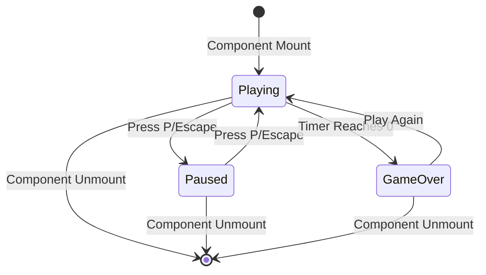
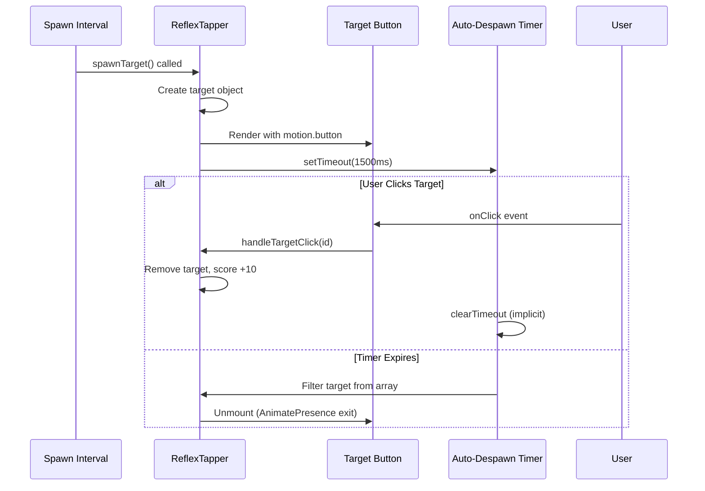

# Reflex Tapper Game Component — Authoritative Documentation

## Executive Summary

Reflex Tapper is a time-based action game implemented as a standalone React component. Players must click or tap targets that spawn randomly on screen within a 20-second time limit. Each target awards 10 points and disappears after 1.5 seconds if not clicked. The game uses percentage-based positioning for responsive target placement, Framer Motion for spawn/despawn animations, and a countdown timer that automatically ends the game when it reaches zero. State is managed through React hooks with no persistence. The component integrates with the games platform via the games registry and supports pause/resume functionality.

## Audience & Intent

- **Markdown (this document):** Authoritative game logic contracts, state ownership, spawn mechanics, scoring rules, pause/resume behavior, and refactor-safe behavior definitions
- **TypeScript/Code:** Runtime implementation, type definitions, component structure, hook integration
- **CSS/Tailwind:** Visual styling contracts, target positioning, responsive layout, gradient backgrounds

## 1. Architecture Overview

### 1.1 Component Structure

```typescript
ReflexTapper Component
├── State Management
│   ├── targets: Array<Target> (useState)
│   ├── score: number (useState)
│   └── gameState: "idle" | "playing" | "paused" | "gameOver" (useGameState hook)
├── Timer Management
│   ├── timeLeft: number (useCountdown hook)
│   └── resetTimer: function (useCountdown hook)
├── Game Logic Functions
│   ├── spawnTarget: () => void
│   ├── handleTargetClick: (id: number) => void
│   └── resetGame: () => void
├── Effects
│   ├── Target spawn interval (useInterval hook)
│   ├── Countdown timer (useCountdown hook)
│   └── Keyboard handler (useEffect)
└── UI Components
    ├── StatsBar (shared component)
    ├── Target buttons (motion.button)
    └── GameOverModal (shared component)
```

### 1.2 Key Constants

| Constant | Value | Purpose |
|----------|-------|---------|
| Initial time | 20 seconds | Game duration |
| Spawn interval | 800ms | Time between target spawns |
| Target lifetime | 1500ms | Time before target auto-despawns |
| Points per target | 10 | Score awarded per click |
| Spawn area X | 10-90% | Horizontal positioning bounds (percentage) |
| Spawn area Y | 15-85% | Vertical positioning bounds (percentage) |
| Target size | 64px × 64px (w-16 h-16) | Fixed target button dimensions |

### 1.3 Integration Points

| Integration Point | Location | Contract |
|-------------------|----------|----------|
| Platform Mount | `app/games/[slug]/game-client.tsx` | Component mounts as `gameData.component` from games registry |
| Games Registry | `lib/games-registry.tsx` | Registered as `"reflex-tapper"` with metadata |
| Click Input | `onClick` on target buttons | React synthetic click events |
| Keyboard Input | `useEffect` with `keydown` listener | P/P/Escape keys for pause/resume |
| Framer Motion | `motion.button`, `AnimatePresence` | Animation library for spawn/despawn animations |
| Shared Components | `@/components/games/shared` | StatsBar and GameOverModal components |

## 2. State Ownership & Source of Truth (Canonical)

| State | Owner | Type | Persistence | Source of Truth |
|-------|-------|------|-------------|-----------------|
| `targets` | ReflexTapper component | Domain | None | `useState<Array<Target>>` |
| `score` | ReflexTapper component | UI | None | `useState<number>` |
| `gameState` | useGameState hook | Domain | None | `useGameState({ initialState: "playing" })` |
| `timeLeft` | useCountdown hook | Domain | None | `useCountdown(20, () => gameOver(), isPlaying)` |

**Target Interface:**
```typescript
interface Target {
  id: number      // Timestamp (Date.now())
  x: number       // Percentage (10-90)
  y: number       // Percentage (15-85)
}
```

**Game State Values:**
- `"idle"`: Initial state (not used - game starts in "playing")
- `"playing"`: Active game, targets spawning, timer counting
- `"paused"`: Game paused, no spawning, timer stopped
- `"gameOver"`: Timer reached 0, game ended

### 2.1 State Ownership Rules

**Precedence Rules:**
1. **Component Isolation:** All state is component-local. No shared state with other games or platform.
2. **Game State Authority:** `useGameState` hook controls game lifecycle. `isPlaying` flag controls spawn interval and countdown timer execution.
3. **Target Array Immutability:** Target updates create new arrays to trigger React re-renders. Filter operations return new arrays.
4. **Timer Authority:** `useCountdown` hook manages `timeLeft`. When `timeLeft === 0`, `onComplete` callback triggers `gameOver()`.
5. **Score Authority:** Component-owned `score` state. Incremented by 10 per target click. Reset to 0 on game reset.

**State Lifecycle:**
- **Initialization:** All state initialized on component mount via `useState` and hooks with default values
- **Runtime Updates:** State mutated via `setState` calls triggered by spawn interval, timer, or user clicks
- **Pause/Resume:** `isPlaying` flag from `useGameState` controls active effects. When paused, spawn and timer stop.
- **Reset:** `resetGame()` resets all state to initial values and restarts game
- **Cleanup:** All intervals and timeouts cleaned up on component unmount via hook cleanup functions

## 3. Data Persistence

### 3.1 Storage Strategy

**Current Implementation: NONE**

No game state is persisted. All progress is lost on component unmount.

| Storage Type | Usage | Status |
|--------------|-------|--------|
| `localStorage` | Not used | ❌ Not implemented |
| `sessionStorage` | Not used | ❌ Not implemented |
| URL parameters | Not used | ❌ Not implemented |
| Server/database | Not used | ❌ Not implemented |

### 3.2 Failure Modes & Recovery

**No Persistence = No Recovery Needed**

- Game resets to initial state on remount (expected behavior)
- No "resume game" functionality exists
- No data loss scenarios to handle

## 4. State Lifecycle

### 4.1 Game Lifecycle Sequence

```
1. Component Mount
   ├── targets initialized to []
   ├── score initialized to 0
   ├── gameState initialized to "playing" (via useGameState)
   ├── timeLeft initialized to 20 (via useCountdown)
   └── Effects start (spawn interval, countdown timer, keyboard handler)

2. Target Spawn Loop (useInterval)
   ├── setInterval(800ms) calls spawnTarget when isPlaying === true
   ├── spawnTarget() creates new target:
   │   ├── id: Date.now() (timestamp)
   │   ├── x: Math.random() * 80 + 10 (10-90%)
   │   └── y: Math.random() * 70 + 15 (15-85%)
   ├── Target added to targets array (immutable update)
   └── setTimeout(1500ms) removes target if not clicked

3. Countdown Timer (useCountdown)
   ├── setInterval(1000ms) decrements timeLeft when isPlaying === true
   ├── timeLeft decreases: 20 → 19 → ... → 1 → 0
   └── When timeLeft === 0: onComplete() calls gameOver()

4. Target Click
   ├── handleTargetClick(id) called
   ├── Target removed from targets array (filter operation)
   └── score incremented by 10

5. Pause/Resume
   ├── User presses P/Escape key
   ├── If isPlaying: pause() called → gameState = "paused"
   ├── If paused: resume() called → gameState = "playing"
   ├── isPlaying flag controls spawn interval and countdown
   └── Timer and spawn pause/resume automatically

6. Game End
   ├── timeLeft reaches 0
   ├── onComplete() callback triggers gameOver()
   ├── gameState set to "gameOver"
   ├── isPlaying becomes false
   ├── Spawn interval stops (isPlaying check)
   ├── Timer stops (isPlaying check)
   └── GameOverModal displays

7. Reset
   ├── "Play Again" button calls resetGame()
   ├── targets set to []
   ├── score set to 0
   ├── resetTimer(20) resets countdown
   ├── reset() sets gameState to "idle"
   ├── start() sets gameState to "playing"
   └── Effects restart (new game begins)

8. Component Unmount
   ├── Spawn interval cleared (useInterval cleanup)
   ├── Timer timeout cleared (useCountdown cleanup)
   ├── Keyboard listener removed (useEffect cleanup)
   └── All state destroyed
```

## 5. Behaviors (Events & Side Effects)

### 5.1 User Behaviors

| User Action | Trigger | Handler | Side Effect |
|-------------|---------|---------|-------------|
| Click target | `onClick` on target button | `handleTargetClick(id)` | Target removed from array, score +10 |
| Press P/Escape | `keydown` event | Keyboard handler in `useEffect` | Toggles pause/resume state |
| Click "Play Again" | `onPlayAgain` on GameOverModal | `resetGame()` | All state reset, game restarted |

### 5.2 System Behaviors

| System Event | Trigger | Handler | Side Effect |
|--------------|---------|---------|-------------|
| Spawn interval tick | `useInterval` (800ms) | `spawnTarget()` | New target added to array, auto-remove timer started |
| Countdown tick | `useCountdown` (1000ms) | Timer decrement | `timeLeft` decremented by 1 |
| Timer reaches 0 | `useCountdown` onComplete | `gameOver()` callback | Game state set to "gameOver" |
| Target auto-despawn | `setTimeout` (1500ms) | Filter operation | Target removed from array if not clicked |
| Component mount | React lifecycle | Initialization | All state initialized, effects started |
| Component unmount | React lifecycle | Cleanup functions | All intervals/timeouts cleared |

## 6. Event & Callback Contracts

| Event | Trigger | Payload | Side Effects |
|-------|---------|---------|--------------|
| `onClick` (target) | User clicks target button | `id: number` | Target removed, score incremented |
| `onPlayAgain` | User clicks "Play Again" button | None | Game reset and restarted |
| `onComplete` (timer) | Timer reaches 0 | None | Game over state triggered |
| `pause()` | User presses P/Escape while playing | None | Game state set to "paused" |
| `resume()` | User presses P/Escape while paused | None | Game state set to "playing" |

## 7. Performance Considerations

### 7.1 Known Limits

| Threshold | Tested Value | Behavior |
|-----------|--------------|----------|
| Maximum targets on screen | ~18-20 targets | Performance degrades with >20 simultaneous targets |
| Spawn rate | 800ms minimum | Faster spawns cause target overlap and performance issues |
| Target lifetime | 1500ms minimum | Shorter lifetimes cause rapid DOM churn |

### 7.2 Bottlenecks

1. **Target Array Operations:** Filter operations on every click create new arrays. With many targets, this can cause brief lag.
2. **Framer Motion Animations:** Multiple simultaneous animations (spawn/despawn) can impact performance on low-end devices.
3. **setTimeout Accumulation:** Each target spawn creates a setTimeout. With rapid spawning, many timers accumulate.

### 7.3 Optimization Opportunities

- **Memoization:** `spawnTarget` callback is memoized with `useCallback` to prevent unnecessary re-renders
- **Batch Updates:** Target removals could be batched, but current implementation is sufficient for expected load
- **Animation Optimization:** Consider reducing animation complexity for low-end devices

### 7.4 Deferred Optimizations

- **Virtual Scrolling:** Not needed - targets are positioned absolutely, not in a scrollable list
- **Object Pooling:** Target objects could be pooled, but garbage collection handles current load adequately
- **Web Workers:** Spawn calculations are trivial, no benefit from offloading

## 8. Accessibility

### 8.1 Current Gaps

| Issue | Severity | Description |
|-------|----------|-------------|
| No ARIA labels | Major | Target buttons lack accessible labels |
| No keyboard navigation | Major | Targets cannot be focused or activated via keyboard |
| No screen reader announcements | Major | Score changes and game events not announced |
| No focus management | Minor | Focus not trapped in game area |
| No reduced motion support | Minor | Animations not respecting `prefers-reduced-motion` |

### 8.2 Required Tasks

1. **High Priority:**
   - Add `aria-label` to target buttons: `"Target at position X, Y. Click to score points."`
   - Add `role="button"` and keyboard handlers (Enter/Space) for target activation
   - Add `aria-live` region for score announcements

2. **Medium Priority:**
   - Implement focus trap in game area
   - Add skip links for keyboard users

3. **Low Priority:**
   - Respect `prefers-reduced-motion` for animations
   - Add high contrast mode support

## 9. Testing Strategy

### 9.1 Must-Cover Scenarios

1. **Target Spawning:**
   - Targets spawn at 800ms intervals when game is playing
   - Targets do not spawn when game is paused
   - Target positions are within bounds (10-90% x, 15-85% y)
   - Target IDs are unique (timestamp-based)

2. **Target Interaction:**
   - Clicking target removes it and increments score by 10
   - Multiple rapid clicks handled correctly
   - Targets auto-despawn after 1500ms if not clicked

3. **Timer Functionality:**
   - Timer counts down from 20 to 0
   - Timer pauses when game is paused
   - Timer resumes when game resumes
   - Game ends when timer reaches 0

4. **Pause/Resume:**
   - P key pauses game
   - Escape key pauses game
   - P/Escape resume game when paused
   - Spawn and timer stop when paused
   - Spawn and timer resume when resumed

5. **Game Reset:**
   - "Play Again" resets all state
   - Timer resets to 20 seconds
   - Score resets to 0
   - Targets array clears
   - Game restarts automatically

6. **Edge Cases:**
   - Clicking target that's already being removed
   - Game reset during active gameplay
   - Component unmount during active game

### 9.2 Explicitly Not Tested

- **Performance under extreme load:** >30 simultaneous targets (out of scope)
- **Network connectivity:** No network features (N/A)
- **Cross-tab synchronization:** No shared state (N/A)
- **Persistence:** No save/load functionality (out of scope)

## 10. Non-Goals / Out of Scope

1. **Score Persistence:** No high score tracking or leaderboards
2. **Difficulty Levels:** No adjustable spawn rates or timer durations
3. **Multiplayer:** No competitive or cooperative modes
4. **Power-ups:** No special target types or bonuses
5. **Sound Effects:** No audio feedback (visual only)
6. **Mobile Gestures:** Touch works but no swipe/gesture support
7. **Analytics:** No gameplay metrics or telemetry
8. **Customization:** No theme or appearance customization

## 11. Common Pitfalls & Sharp Edges

### 11.1 Known Bugs/Quirks

1. **Stale Closure in handleTargetClick:**
   - **Issue:** `handleTargetClick` uses `targets` and `score` directly from closure, not functional updates
   - **Impact:** If called rapidly, may use stale state values
   - **Fix:** Use functional updates: `setTargets(prev => prev.filter(...))` and `setScore(prev => prev + 10)`

2. **Target ID Collision:**
   - **Issue:** `Date.now()` used for IDs can collide if multiple targets spawn in same millisecond
   - **Impact:** React key conflicts, incorrect target removal
   - **Fix:** Use counter or UUID generator instead

3. **setTimeout Memory Leak:**
   - **Issue:** `setTimeout` in `spawnTarget` not cleaned up if component unmounts
   - **Impact:** Memory leak, potential errors after unmount
   - **Fix:** Store timeout IDs and clear on unmount

### 11.2 Integration Gotchas

1. **Game State Hook Dependency:** Component depends on `useGameState` hook. Changes to hook API break component.
2. **Shared Component Props:** `StatsBar` and `GameOverModal` props must match expected interface.
3. **Framer Motion Version:** Animation behavior depends on Framer Motion version. Breaking changes in library affect animations.

### 11.3 Configuration Mistakes

1. **Spawn Interval Too Fast:** Setting interval < 500ms causes target overlap and performance issues
2. **Target Lifetime Too Short:** Setting lifetime < 1000ms makes game unplayable
3. **Timer Duration:** Setting timer < 10 seconds makes game too difficult

### 11.4 Edge Cases

1. **Rapid Pause/Resume:** Rapidly toggling pause can cause timer desync
2. **Click During Unmount:** Clicking target during component unmount may cause state update errors
3. **Timer Race Condition:** Timer reaching 0 while target is being clicked can cause score to not register

## 12. Diagrams (Optional)

### 12.1 Game State Machine



**Maintenance Rule:** This diagram is **illustrative**, not authoritative. The game state logic defined in Section 4 is the source of truth.

### 12.2 Target Lifecycle



**Maintenance Rule:** This diagram is **illustrative**, not authoritative. The target lifecycle defined in Section 4 is the source of truth.

## Conclusion

This document defines the authoritative architecture, state ownership, game logic contracts, and behavioral rules for the Reflex Tapper game component. It serves as the single source of truth for:

- **Developers modifying game logic:** Must follow spawn mechanics, timer rules, state management patterns, and hook integration
- **Developers adding features:** Must preserve existing contracts, click handling, pause/resume behavior, and game end logic
- **Developers debugging issues:** Reference state ownership table, event contracts, common pitfalls, and hook dependencies
- **Architects planning enhancements:** Reference non-goals to prevent scope creep and performance considerations for optimizations

**Maintenance Expectations:**
- Update this document when game mechanics change
- Document new state variables when added
- Update spawn/timer intervals if changed
- Update hook dependencies if useGameState, useCountdown, or useInterval APIs change
- Archive deprecated patterns if breaking changes occur

**Refactor Safety:**
This document enables safe refactoring by:
- Defining unambiguous state ownership (no conflicts)
- Specifying game logic contracts (spawn, timer, scoring, pause/resume)
- Documenting click handling rules and keyboard shortcuts
- Listing non-goals (prevents accidental feature additions)
- Documenting hook dependencies and integration points

---
**Maintained by:** Development Team  
**Last Updated:** 2026-01-12  
**Version:** 2.0.0
