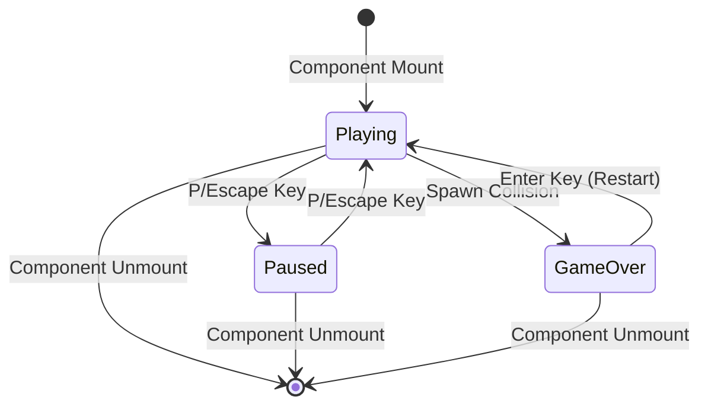

# Tetris Game Component — Authoritative Documentation

## Executive Summary

Tetris is a grid-based falling block puzzle game implemented as a standalone React component. The game uses a fixed timestep game loop with discrete piece movement, collision detection, line clearing mechanics, and progressive difficulty scaling. State is managed entirely through React hooks with no persistence. The game supports both keyboard (WASD/Arrow keys) and touch gesture controls, rendering a 10x20 grid board with ghost piece preview and next piece display.

## Audience & Intent

- **Markdown (this document):** Authoritative game logic contracts, state ownership, input handling rules, scoring mechanics, and refactor-safe behavior definitions
- **TypeScript/Code:** Runtime implementation, type definitions, component structure
- **CSS/Tailwind:** Visual styling contracts, color mappings for tetromino shapes

## 1. Architecture Overview

### 1.1 Component Structure

```typescript
Tetris Component
├── State Management (useState hooks)
│   ├── board: (string | null)[][]
│   ├── currentPiece: Piece
│   ├── nextPiece: Piece
│   ├── score: number
│   ├── level: number
│   ├── linesCleared: number
│   ├── gameState: "playing" | "paused" | "gameOver"
│   ├── fallSpeed: number
│   └── showLevelUp: boolean
├── Refs (useRef)
│   ├── touchStartRef: Touch coordinates
│   └── gameLoopRef: Interval reference
├── Game Logic Functions (useCallback)
│   ├── checkCollision
│   ├── rotatePiece
│   ├── lockPiece
│   ├── moveDown
│   ├── moveHorizontal
│   ├── handleRotate
│   ├── hardDrop
│   ├── handleRestart
│   └── togglePause
└── Effects (useEffect)
    ├── Keyboard event listener
    ├── Touch handlers (onTouchStart/End)
    └── Game loop interval
```

### 1.2 Key Constants

| Constant | Value | Purpose |
|----------|-------|---------|
| `BOARD_WIDTH` | 10 | Grid columns |
| `BOARD_HEIGHT` | 20 | Grid rows |
| `INITIAL_FALL_SPEED` | 1000ms | Starting fall interval |
| `SHAPES` | 7 tetrominoes | Piece definitions (I, O, T, S, Z, J, L) |

### 1.3 Integration Points

| Integration Point | Location | Contract |
|------------------|----------|----------|
| Platform Mount | `app/games/[slug]/game-client.tsx` | Component mounts as `gameData.component` |
| Keyboard Input | `window.addEventListener("keydown")` | Global event listener, cleaned up on unmount |
| Touch Input | `onTouchStart/onTouchEnd` props | React synthetic touch events |
| Framer Motion | `motion.div`, `AnimatePresence` | Animation library for overlays |

## 2. State Ownership & Source of Truth (Canonical)

| State | Owner | Type | Persistence | Source of Truth |
|-------|-------|------|-------------|-----------------|
| `board` | Tetris component | Domain | None | `useState<(string | null)[][]>` |
| `currentPiece` | Tetris component | Domain | None | `useState<Piece>` |
| `nextPiece` | Tetris component | Domain | None | `useState<Piece>` |
| `score` | Tetris component | UI | None | `useState<number>` |
| `level` | Tetris component | Domain | None | `useState<number>` |
| `linesCleared` | Tetris component | Domain | None | `useState<number>` |
| `gameState` | Tetris component | Domain | None | `useState<GameState>` |
| `fallSpeed` | Tetris component | Domain | None | `useState<number>` |
| `showLevelUp` | Tetris component | UI | None | `useState<boolean>` |
| `touchStartRef` | Tetris component | System | None | `useRef<{ x, y, time }>` |
| `gameLoopRef` | Tetris component | System | None | `useRef<NodeJS.Timeout>` |

### 2.1 State Ownership Rules

**Precedence Rules:**
1. **Component Isolation:** All state is component-local. No shared state with other games or platform.
2. **Game State Authority:** `gameState` controls all game logic execution. Functions check `gameState !== "playing"` before executing.
3. **Board Immutability:** Board updates create new arrays (`map`, `[...row]`) to trigger React re-renders.
4. **Piece Generation:** `getRandomPiece()` uses `Math.random()` with no seed. Each piece is independent.

**State Lifecycle:**
- **Initialization:** All state initialized on component mount via `useState` default values
- **Runtime Updates:** State mutated via `setState` calls triggered by game loop, user input, or collision detection
- **Reset:** `handleRestart()` resets all state to initial values
- **Cleanup:** All intervals and event listeners cleaned up on component unmount

## 3. Data Persistence

### 3.1 Storage Strategy

**Current Implementation: NONE**

No game state is persisted. All progress is lost on component unmount.

| Storage Type | Usage | Status |
|--------------|-------|--------|
| `localStorage` | Not used | ❌ Not implemented |
| `sessionStorage` | Not used | ❌ Not implemented |
| URL parameters | Not used | ❌ Not implemented |

### 3.2 Failure Modes & Recovery

**No Persistence = No Recovery Needed**

- Game resets to initial state on remount (expected behavior)
- No "resume game" functionality exists

## 4. State Lifecycle

### 4.1 Game Lifecycle Sequence

```
1. Component Mount
   ├── Initialize board (createEmptyBoard)
   ├── Initialize currentPiece (getRandomPiece)
   ├── Initialize nextPiece (getRandomPiece)
   ├── Initialize score, level, linesCleared to 0/1
   ├── Set gameState to "playing"
   ├── Set fallSpeed to INITIAL_FALL_SPEED (1000ms)
   └── Attach keyboard/touch listeners

2. Game Loop Start
   ├── setInterval(moveDown, fallSpeed) starts
   ├── Piece falls every fallSpeed milliseconds
   └── Collision checked on each fall

3. Piece Movement (User Input)
   ├── Keyboard/touch input triggers move/rotate
   ├── checkCollision validates move
   ├── If valid: update currentPiece position
   └── If invalid: action ignored

4. Piece Lock
   ├── moveDown detects collision
   ├── lockPiece() called
   ├── Current piece merged into board
   ├── Lines checked and cleared
   ├── Score updated based on lines cleared
   ├── Level updated if linesCleared threshold met
   ├── fallSpeed decreased if level increased
   ├── Next piece becomes current
   ├── New next piece generated
   └── Game over checked (collision on spawn)

5. Game Over
   ├── lockPiece detects collision on nextPiece spawn
   ├── gameState set to "gameOver"
   ├── Game loop stops (interval cleared)
   └── Overlay displays final score

6. Component Unmount
   ├── Game loop interval cleared
   ├── Keyboard event listener removed
   └── All state destroyed
```

## 5. Behaviors (Events & Side Effects)

### 5.1 User Behaviors

| User Action | Trigger | Handler | Side Effect |
|-------------|---------|---------|-------------|
| Press ArrowLeft/A | `keydown` | `moveHorizontal(-1)` | Piece moves left if no collision |
| Press ArrowRight/D | `keydown` | `moveHorizontal(1)` | Piece moves right if no collision |
| Press ArrowDown/S | `keydown` | `moveDown()` + score +1 | Piece moves down, score increases |
| Press ArrowUp/W | `keydown` | `handleRotate()` | Piece rotates 90° clockwise |
| Press Space | `keydown` | `hardDrop()` | Piece drops to bottom instantly, score +2 per cell |
| Press P/Escape | `keydown` | `togglePause()` | Toggles gameState between "playing" and "paused" |
| Press Enter (game over) | `keydown` | `handleRestart()` | Resets all state, starts new game |
| Tap screen | `onTouchStart/End` | Gesture detection | Tap = rotate, swipe = move/drop |
| Click Pause button | `onClick` | `togglePause()` | Toggles pause state |

### 5.2 System Behaviors

| System Event | Trigger | Handler | Side Effect |
|--------------|---------|---------|-------------|
| Game loop tick | `setInterval` (fallSpeed) | `moveDown()` | Piece falls one cell, collision checked |
| Line completion | `lockPiece()` detects full row | Line clearing logic | Lines removed, score updated, level may increase |
| Level up | `linesCleared` reaches threshold (10 per level) | Level calculation | Level increases, fallSpeed decreases, showLevelUp animation |
| Piece spawn collision | `lockPiece()` checks nextPiece | Collision detection | `gameState` set to "gameOver" |
| Component unmount | React lifecycle | Cleanup in useEffect returns | Intervals cleared, listeners removed |

## 6. Event & Callback Contracts

### 6.1 Keyboard Input Contract

```typescript
useEffect(() => {
  const handleKeyDown = (e: KeyboardEvent) => {
    // Non-playing states
    if (gameState !== "playing") {
      if (e.key === "Enter" && gameState === "gameOver") {
        handleRestart()
      }
      if ((e.key === "p" || e.key === "P" || e.key === "Escape") && gameState === "paused") {
        setGameState("playing")
      }
      return
    }

    // Playing state - key mappings
    switch (e.key) {
      case "ArrowLeft": case "a": case "A":
        e.preventDefault()
        moveHorizontal(-1)
        break
      case "ArrowRight": case "d": case "D":
        e.preventDefault()
        moveHorizontal(1)
        break
      case "ArrowDown": case "s": case "S":
        e.preventDefault()
        moveDown()
        setScore((prev) => prev + 1)
        break
      case "ArrowUp": case "w": case "W":
        e.preventDefault()
        handleRotate()
        break
      case " ":
        e.preventDefault()
        hardDrop()
        break
      case "p": case "P": case "Escape":
        e.preventDefault()
        togglePause()
        break
    }
  }
  window.addEventListener("keydown", handleKeyDown)
  return () => window.removeEventListener("keydown", handleKeyDown)
}, [gameState, moveHorizontal, moveDown, handleRotate, hardDrop, handleRestart, togglePause])
```

**Contract Rules:**
- Must call `e.preventDefault()` for handled keys
- Must check `gameState !== "playing"` before game actions
- Must clean up listener on unmount
- Dependencies array must include all callback functions

### 6.2 Touch Input Contract

```typescript
const handleTouchStart = (e: React.TouchEvent) => {
  const touch = e.touches[0]
  touchStartRef.current = { x: touch.clientX, y: touch.clientY, time: Date.now() }
}

const handleTouchEnd = (e: React.TouchEvent) => {
  if (!touchStartRef.current) return
  
  const touch = e.changedTouches[0]
  const deltaX = touch.clientX - touchStartRef.current.x
  const deltaY = touch.clientY - touchStartRef.current.y
  const deltaTime = Date.now() - touchStartRef.current.time
  
  const absX = Math.abs(deltaX)
  const absY = Math.abs(deltaY)
  
  // Tap: < 30px movement, < 200ms
  if (absX < 30 && absY < 30 && deltaTime < 200) {
    handleRotate()
  }
  // Swipe horizontal: > 50px horizontal, > vertical
  else if (absX > absY && absX > 50) {
    moveHorizontal(deltaX > 0 ? 1 : -1)
  }
  // Swipe down: > 50px vertical, > horizontal
  else if (absY > absX && deltaY > 50) {
    hardDrop()
  }
  
  touchStartRef.current = null
}
```

**Contract Rules:**
- Touch start stores coordinates and timestamp in ref
- Touch end calculates deltas and interprets gesture
- Tap threshold: 30px movement, 200ms duration
- Swipe threshold: 50px movement in primary direction

### 6.3 Game Loop Contract

```typescript
useEffect(() => {
  if (gameState === "playing") {
    gameLoopRef.current = setInterval(moveDown, fallSpeed)
    return () => {
      if (gameLoopRef.current) clearInterval(gameLoopRef.current)
    }
  }
}, [moveDown, fallSpeed, gameState])
```

**Contract Rules:**
- Loop only runs when `gameState === "playing"`
- Interval cleared on unmount or state change
- `fallSpeed` dependency ensures interval updates when level changes

## 7. Game Logic Contracts

### 7.1 Collision Detection

```typescript
checkCollision(piece: Piece, board: (string | null)[][], offsetX = 0, offsetY = 0): boolean
```

**Rules:**
- Checks if piece shape overlaps with board boundaries or occupied cells
- Returns `true` if collision detected, `false` if valid position
- Checks all non-zero cells in piece shape array
- Boundary checks: `newX < 0 || newX >= BOARD_WIDTH || newY >= BOARD_HEIGHT`
- Board collision: `board[newY]?.[newX] !== null`

### 7.2 Rotation Logic

```typescript
rotatePiece(piece: Piece): number[][]
```

**Rules:**
- Rotates 90° clockwise: `shape[0].map((_, i) => shape.map(row => row[i]).reverse())`
- No wall-kick or rotation adjustment (simple rotation only)
- Collision checked after rotation, rotation rejected if collision

### 7.3 Line Clearing

**Rules:**
- Lines checked bottom-to-top after piece lock
- Full line: `row.every(cell => cell !== null)`
- Completed lines removed: `newBoard.splice(line, 1)` then `newBoard.unshift(Array(BOARD_WIDTH).fill(null))`
- Score calculation: `lineScores[completedLines.length - 1] * level`
  - 1 line: 100 * level
  - 2 lines: 300 * level
  - 3 lines: 500 * level
  - 4 lines: 800 * level

### 7.4 Level Progression

**Rules:**
- Level increases every 10 lines cleared: `Math.floor(linesCleared / 10) + 1`
- Fall speed decreases: `Math.max(100, INITIAL_FALL_SPEED - (level - 1) * 100)`
- Minimum fall speed: 100ms (maximum difficulty)
- Level up animation: `showLevelUp` set to `true` for 2000ms

### 7.5 Scoring System

| Action | Points | Formula |
|--------|--------|---------|
| Soft drop (ArrowDown/S) | +1 | Per cell moved down |
| Hard drop (Space) | +2 per cell | `dropDistance * 2` |
| Line clear (1 line) | 100 × level | `100 * level` |
| Line clear (2 lines) | 300 × level | `300 * level` |
| Line clear (3 lines) | 500 × level | `500 * level` |
| Line clear (4 lines) | 800 × level | `800 * level` |

## 8. Performance Considerations

### 8.1 Known Limits

| Metric | Current Limit | Tested Threshold | Notes |
|--------|---------------|-----------------|-------|
| Board size | 10×20 (200 cells) | Not tested | CSS Grid handles efficiently |
| Game loop frequency | 1000ms (initial) to 100ms (max) | 16ms (60fps equivalent) | Fixed timestep prevents frame dependency |
| Concurrent pieces | 1 current + 1 next | 2 | Minimal memory footprint |
| Re-render frequency | Every game tick + user input | Not tested | React optimizations handle efficiently |

### 8.2 Bottlenecks

**Current Bottlenecks:**
- None identified in current implementation

**Potential Bottlenecks:**
- Large board re-renders on every tick (mitigation: React virtual DOM handles efficiently)
- Collision detection loops through all piece cells (O(n) where n = piece size, acceptable)

### 8.3 Optimization Opportunities

**Deferred Optimizations:**
- **Memoization:** `renderBoard()` recalculates on every render (not memoized, but acceptable performance)
- **Virtual Scrolling:** Not applicable (fixed board size)
- **Web Workers:** Not applicable (DOM rendering requires main thread)

## 9. Accessibility

### 9.1 Current Gaps

| Issue | Severity | Description |
|-------|----------|-------------|
| Keyboard navigation | Minor | All controls keyboard-accessible, but no visible focus indicators |
| Screen reader support | Major | No ARIA labels, roles, or live regions for game state |
| Color contrast | Unknown | Tetromino colors not audited against WCAG AA |
| Game state announcements | Major | No announcements for level up, game over, line clears |
| Touch target size | Minor | Board cells are 24×24px (w-6 h-6), may be small for some users |

### 9.2 Required Tasks (Prioritized)

1. **Critical:** Add ARIA labels to board cells, next piece, stats
2. **Critical:** Add `role="application"` to game container
3. **High:** Add live region for game state changes (level up, game over)
4. **High:** Add keyboard focus indicators
5. **Medium:** Audit color contrast for all tetromino colors
6. **Medium:** Increase touch target size or add touch-friendly controls

## 10. Testing Strategy

### 10.1 Must-Cover Scenarios

**Game Logic:**
- [ ] Piece spawns at correct position (center top)
- [ ] Piece falls at correct interval (fallSpeed)
- [ ] Collision detection prevents out-of-bounds movement
- [ ] Collision detection prevents overlapping with locked pieces
- [ ] Rotation works correctly for all 7 piece types
- [ ] Line clearing removes full rows
- [ ] Score updates correctly for all actions
- [ ] Level increases every 10 lines
- [ ] Fall speed decreases with level
- [ ] Game over triggers on spawn collision

**Input Handling:**
- [ ] All keyboard controls work (WASD, Arrows, Space, P, Enter)
- [ ] Touch tap triggers rotate
- [ ] Touch swipe left/right triggers move
- [ ] Touch swipe down triggers hard drop
- [ ] Pause button toggles game state
- [ ] Game loop stops when paused
- [ ] Game loop stops when game over

**State Management:**
- [ ] Component initializes with correct default state
- [ ] Restart resets all state correctly
- [ ] State updates trigger re-renders
- [ ] Cleanup removes all intervals and listeners

### 10.2 Explicitly Not Tested

- **Cross-browser compatibility:** Not explicitly tested
- **Performance under stress:** No load testing
- **Accessibility compliance:** Not audited (see Section 9)
- **Mobile device testing:** Not tested on physical devices

## 11. Non-Goals / Out of Scope

The following features are explicitly **not** part of the current implementation:

1. **Hold Piece:** No piece holding/queuing mechanism
2. **Ghost Piece Preview:** Implemented but no visual distinction beyond opacity
3. **Wall Kicks:** No rotation adjustment when piece hits wall
4. **T-Spins:** No special T-piece rotation mechanics
5. **Combo Scoring:** No bonus for consecutive line clears
6. **High Score Persistence:** No localStorage or server storage
7. **Replay System:** No recording or playback
8. **Multiplayer:** No network synchronization
9. **Custom Controls:** No key rebinding
10. **Difficulty Selection:** No starting level or speed options

## 12. Common Pitfalls & Sharp Edges

### 12.1 Known Bugs/Quirks

| Issue | Location | Impact | Workaround |
|-------|----------|--------|------------|
| None documented | - | - | - |

### 12.2 Integration Gotchas

**State Update Timing:**
- **Issue:** `lockPiece()` uses current `board` state, but state may not be updated yet
- **Example:** Multiple rapid moves may cause state inconsistency
- **Prevention:** Always use functional updates (`setBoard(prev => ...)`) when state depends on previous state

**Game Loop Dependency:**
- **Issue:** `gameLoopRef` not in dependency array, but `moveDown` is
- **Example:** If `moveDown` changes, interval may not update correctly
- **Prevention:** Current implementation handles this correctly, but be careful with refs

**Touch Gesture Conflicts:**
- **Issue:** Rapid taps may be interpreted as swipes
- **Example:** User tries to rotate quickly, but gesture detected as move
- **Prevention:** Current thresholds (30px, 200ms) balance responsiveness and accuracy

### 12.3 Configuration Mistakes

**Missing Game State Check:**
- **Issue:** Functions don't check `gameState !== "playing"` before executing
- **Fix:** All movement/rotation functions must check game state first

**Incorrect Collision Check:**
- **Issue:** Collision detection doesn't account for piece shape offset
- **Fix:** Always check all non-zero cells in piece shape array

**Interval Not Cleared:**
- **Issue:** Game loop interval not cleared on unmount or state change
- **Fix:** Always return cleanup function from useEffect

### 12.4 Edge Cases

**Rapid Input:**
- **Scenario:** User presses multiple keys rapidly
- **Behavior:** Each keypress triggers action, but game state may not update fast enough
- **Risk:** Low (React batches state updates)

**Piece Spawn at Game Over:**
- **Scenario:** Board is nearly full, next piece spawns in collision
- **Behavior:** Game over triggered immediately
- **Risk:** None (expected behavior)

**Level Up During Pause:**
- **Scenario:** Line clear triggers level up while game is paused
- **Behavior:** Level up animation shows, but game loop doesn't restart until unpaused
- **Risk:** None (expected behavior)

## 13. Diagrams (Optional)

### 13.1 Game State Machine



**Maintenance Rule:** This diagram is **illustrative**, not authoritative. The game state logic defined in Section 4 is the source of truth.

## Conclusion

This document defines the authoritative architecture, state ownership, game logic contracts, and behavioral rules for the Tetris game component. It serves as the single source of truth for:

- **Developers modifying game logic:** Must follow collision detection rules, scoring formulas, and state management patterns
- **Developers adding features:** Must preserve existing contracts, input handling, and game loop behavior
- **Developers debugging issues:** Reference state ownership table, event contracts, and common pitfalls
- **Architects planning enhancements:** Reference non-goals to prevent scope creep, performance considerations for optimization

**Maintenance Expectations:**
- Update this document when game mechanics change
- Document new state variables when added
- Update scoring formulas if changed
- Archive deprecated patterns if breaking changes occur

**Refactor Safety:**
This document enables safe refactoring by:
- Defining unambiguous state ownership (no conflicts)
- Specifying game logic contracts (collision, rotation, scoring)
- Documenting input handling rules (keyboard and touch)
- Listing non-goals (prevents accidental feature additions)

---

**Maintained by:** Development Team  
**Last Updated:** 2025-01-27  
**Version:** 1.0.0
